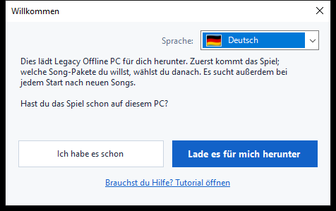
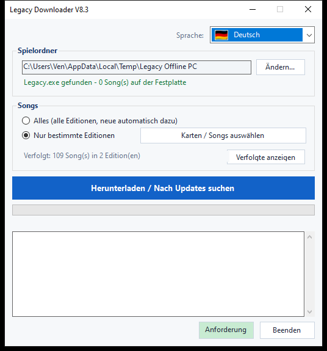
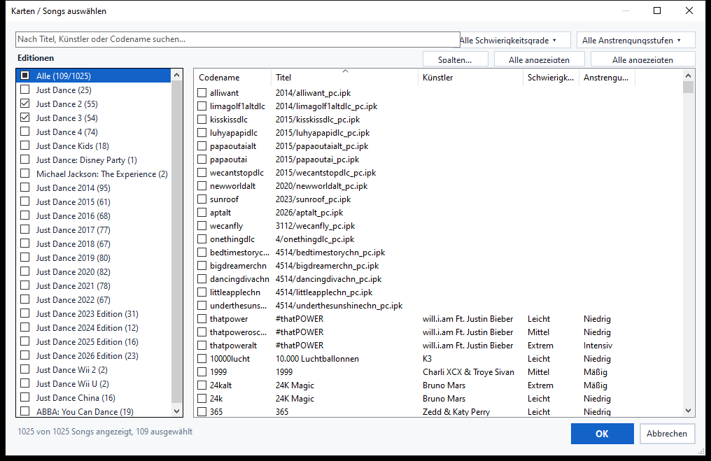
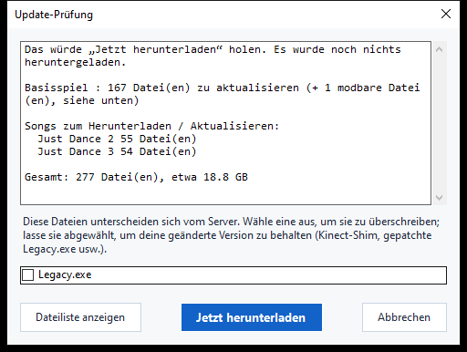

# Legacy Downloader — Anleitung

Legacy Downloader lädt **Legacy Offline PC** und die Song-Pakete auf deinen
Computer und hält sie aktuell. Du brauchst keine technischen Kenntnisse
dafür — folge einfach den Bildern unten, der Reihe nach.

Andere Sprachen: [English](en.md) · [Français](fr.md) · [Español](es.md) ·
[Italiano](it.md) · [Português](pt.md) · [Nederlands](nl.md) · [日本語](ja.md) ·
[한국어](ko.md) · [简体中文](zh-Hans.md) · [繁體中文](zh-Hant.md) · [Русский](ru.md)

---

## Schnellstart

Für alle, die nur die Kurzversion wollen:

1. Lade den Zip von der [Releases-Seite](https://github.com/VenB304/LegacyDownloader/releases) herunter und
   entpacke ihn.
2. Doppelklicke auf `LegacyDownloader-GUI.bat`.
3. Folge den Schritten im Begrüßungsfenster, wähle deine Songs aus und
   klicke auf **„Herunterladen / Nach Updates suchen"**.
4. Wenn „Du bist aktuell!" erscheint, öffne `Legacy.exe` in deinem
   Spielordner und spiel los.

Falls etwas verwirrend wirkt oder nicht zur Beschreibung passt, hat die
ausführliche Anleitung unten für jeden Bildschirm ein Bild.

---

## 1. Herunterladen und entpacken

1. Lade das neueste `LegacyDownloaderVX.zip` von der [Releases-Seite](https://github.com/VenB304/LegacyDownloader/releases) herunter.
2. Entpacke es — Rechtsklick auf die Zip → **Alle extrahieren...** → wähle
   einen normalen Ordner (der Desktop geht auch). Führe es nicht direkt aus
   dem Zip-Fenster heraus aus.
3. Öffne den entpackten Ordner und doppelklicke auf
   **`LegacyDownloader-GUI.bat`**.


> Falls dein Antivirenprogramm `rclone.exe` (eine Datei im `bin`-Ordner hier)
> meldet, sieh dir den Abschnitt [Problembehebung](#problembehebung) unten
> an — das ist ein bekannter Fehlalarm, kein echtes Problem mit dem Download.

## 2. Erster Start — Begrüßungsfenster

Als Nächstes erscheint ein **„Willkommen"**-Fenster.



- **Falsche Sprache angezeigt?** Klick auf das Flaggen-Dropdown in der Ecke
  und wähle deine — das ganze Programm wechselt sofort.
- Beantworte dann die eine gestellte Frage:
  - **„Ich habe es schon"** — wähle das, wenn Legacy Offline PC schon
    irgendwo auf diesem PC ist.
  - **„Lade es für mich herunter"** — wähle das, wenn du das Spiel noch
    nicht hast. Alles Weitere läuft automatisch.

### Wenn du das Spiel schon hast
Ein Ordnerfenster öffnet sich. Finde und klicke den Ordner an, der
**`Legacy.exe`** direkt enthält (nicht in einem Unterordner), und klicke
dann auf **Ordner auswählen**.

### Wenn du das Spiel noch nicht hast
Ein Ordnerfenster öffnet sich, damit du auswählen kannst, wo das Spiel
leben soll — ein leerer Ordner oder ein neuer, den du direkt dort anlegst
(es gibt einen „Neuer Ordner"-Button in diesem Fenster). Klick auf
**Ordner auswählen**, und der Download des Spiels startet sofort — kein
weiterer Button nötig.

Dieser erste Download ist groß — etwa **1,2 GB**, meist zwischen 5 und
20 Minuten je nach Internetverbindung. **Lass das Fenster geöffnet**, bis
er fertig ist; der Fortschritt wird im Fenster angezeigt.

> Songs sind nicht Teil dieses ersten Downloads — das ist nur das
> Basisspiel selbst, also mach dir keine Sorgen, wenn noch keine Songs
> auftauchen.

## 3. Das Hauptfenster

Sobald das Basisspiel vorhanden ist, landest du hier:



- **Spielordner** — wo dein Spiel lebt. **Ändern...** lässt dich woanders
  hinzeigen, falls du das Spiel jemals verschiebst.
- **Songs** — wähle aus:
  - **Alles** — jede verfügbare Just-Dance-Edition, und neue werden später
    automatisch dazugeholt. Das ist die einfachste Option, wenn du dir
    nicht sicher bist — wähle diese.
  - **Bestimmte Editionen** — wähle stattdessen genau das, was du willst.
    Klicke auf **„Karten / Songs auswählen"**, um den Picker zu öffnen —
    dazu mehr im nächsten Schritt.
- **„Herunterladen / Nach Updates suchen"** — der große Button. Klicke ihn,
  um zu holen, was du ausgewählt hast, und klicke ihn später erneut, um
  nach neuen Songs oder Updates zu suchen.

## 4. Einzelne Songs auswählen

Klicke jederzeit im Hauptfenster auf **„Karten / Songs auswählen"**, um den
Picker zu öffnen:



- **Editionen**, links — hake eine ganze Edition an, um alles daraus zu
  holen. Ein halb ausgefülltes Kästchen bedeutet, dass nur einige Songs
  dieser Edition ausgewählt sind.
- **Songs**, rechts — jeder einzelne Song, mit Edition, Schwierigkeit und
  Anstrengung (Trainingsintensität), soweit bekannt. Hake einzelne Songs
  an oder ab — du musst nicht immer eine ganze Edition auf einmal nehmen.
- **Suche** — tippe einen Titel, Künstler oder Codenamen ein, um die Liste
  sofort zu filtern.
- **Filter** — grenze die Liste über die Dropdowns oben rechts weiter nach
  Schwierigkeit oder Anstrengung ein.
- **Alle angezeigten auswählen / Alle angezeigten abwählen** — wähle alles,
  was deine aktuelle Suche oder dein Filter gerade anzeigt, statt Song für
  Song zu klicken.
- **Spalten...** — blende die Spalten Künstler, Schwierigkeit oder
  Anstrengung ein oder aus, wenn du eine einfachere Ansicht willst.

Klicke auf **OK**, um deine Auswahl zu speichern, oder auf **Abbrechen**,
um ohne Änderungen zurückzugehen.

> Songs, für die die Community-Liste noch keinen Namen hat, tauchen trotzdem
> auf (nur mit ihrem Dateinamen statt einem Titel) — sie werden trotzdem
> heruntergeladen und funktionieren, nur eben ohne netten Namen, bis
> jemand einen hinzufügt.

## 5. Nach Updates suchen

Ein Klick auf den großen Button lädt nicht sofort etwas herunter — er
**prüft** zuerst, was fehlt oder sich geändert hat. Während der Prüfung
kann sich der Fortschrittsbalken einfach hin und her bewegen, ohne
Prozentanzeige — das ist normal, es bedeutet nur, dass er noch deine
Dateien mit dem Server vergleicht, nicht dass er hängt.



Sobald die Prüfung fertig ist, listet ein Fenster auf, was gefunden wurde,
mit einer Gesamtgröße. Klick auf **„Jetzt herunterladen"**, um die Dateien
tatsächlich zu holen, oder auf **„Abbrechen"**, wenn du nur sehen wolltest,
was verfügbar ist. Wenn sich seit dem letzten Mal nichts geändert hat,
steht dort einfach **„Alles ist bereits aktuell"** — nichts zu klicken.

<details>
<summary>Wenn du deine Spieldateien verändert hast (Kinect-Mod, gepatchte exe) — zum Aufklappen klicken</summary>

Wenn sich eine von dir persönlich veränderte Datei (`Legacy.exe` oder eine
Kinect-DLL) von der Server-Version unterscheidet, bekommt sie eine eigene
Checkbox, statt automatisch mit einbezogen zu werden:
- **Angehakt** = mit der Server-Version ersetzen (wähle das, wenn du
  nichts modifiziert hast — es ist nur ein normales Spiel-Update).
- **Nicht angehakt** = deine eigene Version so belassen, wie sie ist.

Deine Spieleinstellungen (Auflösung, Fenster-/Vollbildmodus) werden bei
einem Update nie angerührt, ob modifiziert oder nicht.
</details>

## 6. Während des Downloads

Der Fortschrittsbalken und das Protokollfeld darunter aktualisieren sich
live — du siehst das Spiel und jedes Song-Paket aufgelistet, sobald sie
fertig sind, eins nach dem anderen. **Schließe das Fenster nicht, während
das läuft.** Wenn alles fertig ist, siehst du:

> **Du bist aktuell! Öffne Legacy.exe in deinem Spielordner, um zu
> spielen.**

Das ist deine Bestätigung, dass alles geklappt hat — geh und starte das
Spiel.

## 7. Später wiederkommen für neue Songs

Starte `LegacyDownloader-GUI.bat` einfach jederzeit erneut. Es merkt sich
deinen Ordner und deine Song-Auswahl, und ein Klick auf **„Herunterladen /
Nach Updates suchen"** holt alles Neue seit deinem letzten Besuch.

- **Songs hinzufügen oder entfernen**: klicke wieder auf **„Karten / Songs
  auswählen"**, hake an oder ab, was du willst, und klicke auf OK. Wenn du
  etwas bereits Heruntergeladenes abwählst — eine ganze Edition oder nur
  ein paar Songs —, wirst du gefragt, ob auch die Dateien gelöscht werden
  sollen oder ob nur die Updates dafür gestoppt werden sollen, während du
  behältst, was du schon hast.
- **Sprache ändern**: das Flaggen-Dropdown oben rechts, jederzeit.

---

## Text-/Konsolenversion (fortgeschritten — die meisten brauchen das nicht)

Es gibt auch eine Textmenü-Version, für die Fehlerbehebung oder falls du
sie bevorzugst: doppelklicke stattdessen auf
**`LegacyDownloader-Console.bat`**. Gleiche Funktionen, Navigation mit
Zifferntasten:

```
[1] Herunterladen / nach neuen Songs suchen
[2] Songs auswählen
[3] Spielordner ändern
[4] Sprache
[5] Beenden
```

> **Hinweis zur Schriftart:** Die grafische Version zeigt alle Sprachen
> korrekt an. Diese Textversion braucht eine Schriftart mit den richtigen
> Zeichen — Japanisch, Koreanisch, Chinesisch und Russisch können hier als
> Kästchen (□) erscheinen. Wenn du eine dieser Sprachen willst, bleib bei
> der grafischen Version.

---

## Problembehebung

- **Antivirus setzt `rclone.exe` unter Quarantäne oder löscht es** — ein
  bekannter Fehlalarm. Manche Antivirenprogramme melden `rclone` als
  „Hacktool", weil Angreifer es auch nutzen können, aber es ist ein
  legitimes, weit verbreitetes Open-Source-Tool und das Einzige, was
  dieses Programm zum Abrufen von Dateien verwendet. Stelle es aus der
  Quarantäne/dem Verlauf deines Antivirenprogramms wieder her, erlaube es,
  und starte `LegacyDownloader-GUI.bat` erneut.
- **Eine Sicherheitswarnung erscheint beim Doppelklick auf
  `LegacyDownloader-GUI.bat`** — das kann beim ersten Ausführen eines
  heruntergeladenen Skripts passieren. Klick dich durch („Weitere
  Informationen → Trotzdem ausführen" oder ähnlich formuliert) — das ist
  bei einem kleinen, unabhängigen Tool normal, kein Zeichen für ein
  Problem.
- **Meldung „rclone.exe fehlt"** — lade das Zip erneut herunter und
  entpacke es neu; führe das Tool nicht aus dem Zip-Viewer heraus aus.
- **Nichts passiert, wenn ich auf einen Ordner-Button klicke** — das
  Auswahlfenster hat sich vielleicht *hinter* dem Hauptfenster geöffnet;
  prüfe deine Taskleiste.
- **Es sagt „aktuell", aber mir fehlen Songs** — öffne **„Karten / Songs
  auswählen"** und prüfe, ob du wirklich die gewünschten angehakt hast
  (oder wähle **„Alles"**).
- **Immer noch festgefahren?** Poste im Legacy-Downloader-Thread auf
  Discord einen Screenshot von dem, was du siehst, und bei welchem
  Schritt du bist — jemand hilft dir.
