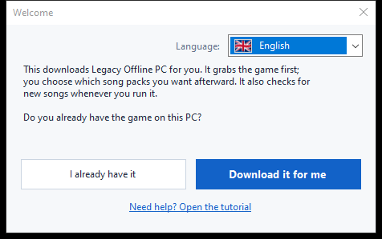
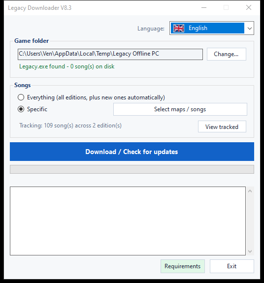
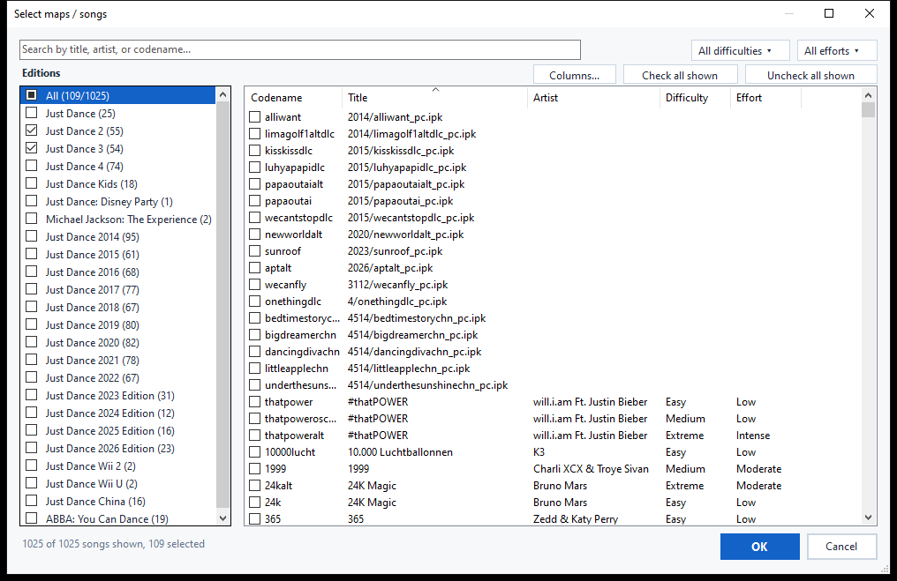
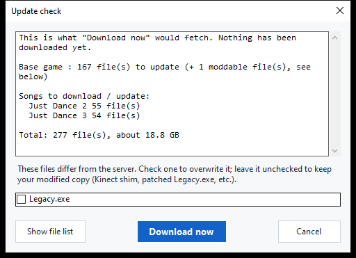

# Legacy Downloader — Tutorial

Legacy Downloader gets **Legacy Offline PC** and its song packs onto your
computer and keeps them updated. You don't need any technical knowledge to
use it — just follow the pictures below, in order.

Other languages: [Français](fr.md) · [Español](es.md) · [Filipino](fil.md) · [Deutsch](de.md) ·
[Italiano](it.md) · [Português](pt.md) · [Nederlands](nl.md) · [日本語](ja.md) ·
[한국어](ko.md) · [简体中文](zh-Hans.md) · [繁體中文](zh-Hant.md) · [Русский](ru.md)

---

## Quick start

For anyone who just wants the short version:

1. Download the zip from the [Releases page](https://github.com/VenB304/LegacyDownloader/releases) and extract it.
2. Double-click `LegacyDownloader-GUI.bat`.
3. Follow the on-screen welcome steps, pick your songs, and click
   **Download / Check for updates**.
4. When it says "You're all set!", open `Legacy.exe` in your game folder to
   play.

If anything looks confusing or doesn't match what's described, the detailed
walkthrough below has a picture for every screen.

---

## 1. Download and extract

1. Grab the latest `LegacyDownloaderVX.zip` from the [Releases page](https://github.com/VenB304/LegacyDownloader/releases).
2. Extract it — right-click the zip → **Extract All...** → pick a normal
   folder (Desktop is fine). Don't run it from inside the zip window itself.
3. Open the extracted folder and double-click **`LegacyDownloader-GUI.bat`**.


> If your antivirus flags `rclone.exe` (inside the `bin` folder here), see
> the [Troubleshooting](#troubleshooting) section below — that's a known
> false positive, not an actual problem with the download.

## 2. First run — Welcome screen

A **Welcome** window appears next.



- **Wrong language showing?** Click the flag dropdown in the corner and pick
  yours — the whole program switches instantly.
- Then answer the one question it asks:
  - **"I already have it"** — pick this if Legacy Offline PC is already on
    this PC somewhere.
  - **"Download it for me"** — pick this if you don't have the game yet.
    Everything after this is automatic.

### If you already have the game
A folder window pops up. Find and click the folder that has **`Legacy.exe`**
directly inside it (not a subfolder), then click **Select Folder**.

### If you don't have the game yet
A folder window pops up so you can pick where the game should live — an
empty folder, or a new one you create right there (there's a "New Folder"
button in that window). Click **Select Folder**, and the game starts
downloading immediately — no extra button to press.

This first download is large — roughly **1.2 GB**, usually somewhere
between 5 and 20 minutes depending on your internet. **Leave the window
open** until it finishes; you'll see progress moving in the window.

> Songs are a separate, second step — the first download is just the base
> game itself, so don't worry that no songs appeared yet.

## 3. The main window

Once the base game is in place, you land here:



- **Game folder** — where your game lives. **Change...** lets you point it
  somewhere else if you ever move the game.
- **Songs** — pick what you want:
  - **Everything** — every Just Dance edition available, and it'll grab new
    ones automatically as they get added later. This is the simplest option
    if you're not sure — pick this one.
  - **Specific** — pick exactly what you want instead. Click **Select
    maps / songs** to open the picker — covered in the next step.
- **Download / Check for updates** — the big button. Click it to fetch
  whatever you picked, and click it again any time later to check for new
  songs or updates.

- **Requirements** — checks whether the extra software Legacy needs (Kinect SDKs, Visual C++ runtimes) is installed, and lets you install anything missing.

## 4. Picking individual songs

Click **Select maps / songs** (from the main window, any time) to open the
picker:



- **Editions**, on the left — tick a whole edition's checkbox to grab
  everything in it. A checkbox that looks half-filled means only some of
  that edition's songs are picked.
- **Songs**, on the right — every individual song, with its edition,
  difficulty, and effort (workout intensity) rating where known. Tick or
  untick any song on its own — no need to grab a whole edition at once.
- **Search** — type a title, artist, or codename to filter the list
  instantly.
- **Filters** — narrow the list further by Difficulty or Effort using the
  dropdowns in the top-right corner.
- **Check all shown / Uncheck all shown** — bulk-select whatever your
  current search or filter is showing, instead of clicking song by song.
- **Columns...** — show or hide the Artist, Difficulty, or Effort columns
  if you want a simpler view.

Click **OK** to save your picks, or **Cancel** to back out without changing
anything.

> Songs the community list doesn't have a name for yet still show up (just
> with their filename instead of a title) — they'll download and work
> fine, just without a friendly name until someone adds one.

## 5. Checking for updates

Clicking the big button doesn't download anything right away — it first
**checks** what you're missing. While it's checking, the progress bar may
just slide back and forth with no percentage shown — that's normal, it
means it's still comparing your files against the server, not stuck.



Once it's done checking, a window lists what it found, with a total size.
Click **Download now** to actually get the files, or **Cancel** if you
just wanted to see what's available. If nothing has changed since last
time, it just says **"Everything is already up to date"** and stops there —
nothing to click.

<details>
<summary>If you've modified your game files (Kinect mod, patched exe) — click to expand</summary>

If a file you've personally changed (`Legacy.exe` or a Kinect DLL) differs
from the server's version, it gets its own checkbox instead of being lumped
in automatically:
- **Checked** = replace it with the server's copy (pick this if you haven't
  modded anything — it's just a normal game update).
- **Unchecked** = keep your own copy as-is.

Your in-game settings (screen resolution, windowed/fullscreen) are never
touched by an update, modded or not.
</details>

## 6. While it downloads

The progress bar and the log box below it update live — you'll see the game
and each song pack listed as they finish, one by one. **Don't close the
window while this is running.** When everything's done, you'll see:

> **You're all set!** Open `Legacy.exe` in your game folder to play.

That's your confirmation it worked — go start the game.

## 7. Coming back later for new songs

Just run `LegacyDownloader-GUI.bat` again any time. It remembers your folder and
your song choices, and clicking **Download / Check for updates** grabs
anything new since your last visit.

- **Add or remove songs**: click **Select maps / songs** again, tick or
  untick whatever you want, and click OK. Unticking something you already
  downloaded — a whole edition or just a few songs — asks whether to
  delete those files too, or just stop getting updates for them while
  keeping what you already have.
- **Change language**: the flag dropdown, top-right, any time.

---

## Text/console version (advanced — most people don't need this)

There's also a plain text-menu version, for troubleshooting or if you prefer
it: double-click **`LegacyDownloader-Console.bat`** instead. Same features,
navigated with number keys:

```
[1] Download / check for new songs
[2] Choose which songs to get
[3] Change game folder
[4] Language
[5] Check software requirements
[6] Exit
```

> **Font note:** the graphical version displays every language correctly.
> This text version needs a font with the right characters — Japanese,
> Korean, Chinese, and Russian may show as boxes (□) here. If you want one
> of those languages, stick with the regular graphical version instead.

---

## Troubleshooting

- **Antivirus quarantines or deletes `rclone.exe`** — a known false
  positive. Some antivirus tools flag `rclone` as a "hacktool" because
  attackers can also use it, but it's a legitimate, widely-used open-source
  tool, and it's the only thing this program uses to fetch files. Restore it
  from your antivirus's quarantine/history, allow it, then run
  `LegacyDownloader-GUI.bat` again.
- **A security warning pops up when you double-click `LegacyDownloader-GUI.bat`**
  — this can happen the first time you run any downloaded script. Click
  through it ("More info → Run anyway", or similar wording) — it's expected
  for a small independently-made tool, not a sign anything's wrong.
- **"rclone.exe is missing" message** — re-download the zip and extract
  again; don't run the tool from inside the zip viewer.
- **Nothing seems to happen when I click a folder button** — the picker
  window may have opened *behind* the main one; check your taskbar.
- **It says "up to date" but I'm missing songs** — open **Select maps /
  songs** and check you've actually ticked the ones you want (or pick
  **Everything**).
- **Still stuck?** Post in the Legacy Downloader thread on Discord with a
  screenshot of what you're seeing and which step you were on — someone
  will help.
