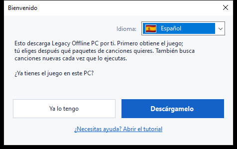
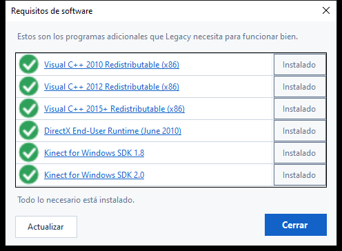
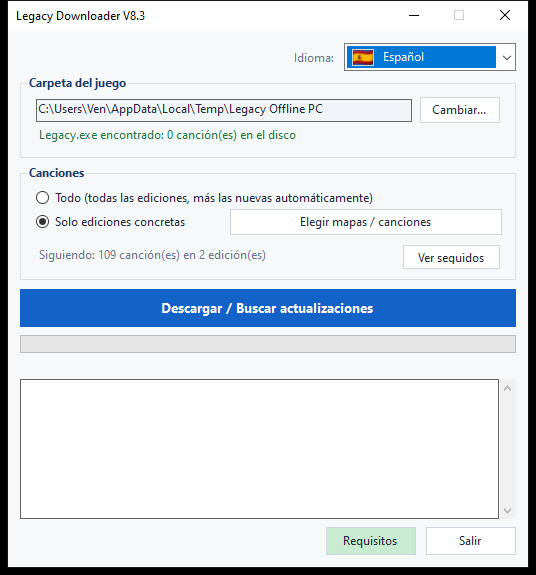
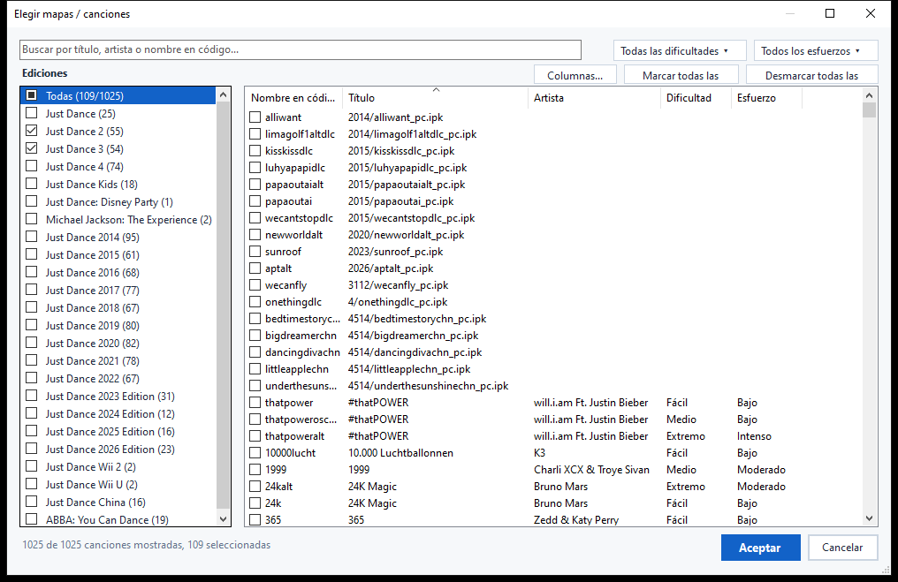
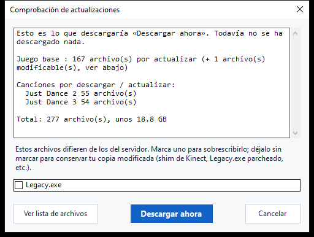

# Legacy Downloader — Tutorial

Legacy Downloader instala **Legacy Offline PC** y sus paquetes de canciones
en tu ordenador, y los mantiene actualizados. No necesitas ningún
conocimiento técnico para usarlo — solo sigue las imágenes de abajo, en
orden.

Otros idiomas: [English](en.md) · [Français](fr.md) · [Filipino](fil.md) ·
[Deutsch](de.md) ·
[Italiano](it.md) · [Português](pt.md) · [Nederlands](nl.md) · [日本語](ja.md) ·
[한국어](ko.md) · [简体中文](zh-Hans.md) · [繁體中文](zh-Hant.md) · [Русский](ru.md)

---

## Inicio rápido

Para quien solo quiera la versión corta:

1. Descarga el zip desde la [página de Releases](https://github.com/VenB304/LegacyDownloader/releases) y
   extráelo.
2. Haz doble clic en `LegacyDownloader-GUI.bat`.
3. Sigue los pasos de la pantalla de bienvenida, elige tus canciones y haz
   clic en **«Descargar / Buscar actualizaciones»**.
4. Cuando aparezca el mensaje **«Estás al día»**, abre `Legacy.exe` en tu
   carpeta del juego para jugar.

Si algo te resulta confuso o no coincide con lo descrito, la guía detallada
de abajo tiene una imagen para cada pantalla.

---

## 1. Descargar y extraer

1. Consigue el último `LegacyDownloaderVX.zip` desde la [página de Releases](https://github.com/VenB304/LegacyDownloader/releases).
2. Extráelo — clic derecho en el zip → **Extraer todo...** → elige una
   carpeta normal (el Escritorio sirve). No lo ejecutes desde dentro de la
   ventana del zip.
3. Abre la carpeta extraída y haz doble clic en **`LegacyDownloader-GUI.bat`**.


> Si tu antivirus marca `rclone.exe` (un archivo dentro de la carpeta `bin`),
> consulta la sección de [Solución de problemas](#solución-de-problemas) más
> abajo — es un falso positivo conocido, no un problema real con la
> descarga.

## 2. Primer inicio — pantalla de bienvenida

A continuación aparece una ventana de **«Bienvenido»**.



- **¿Sale el idioma equivocado?** Haz clic en el menú desplegable de la
  bandera en la esquina y elige el tuyo — el programa cambia al instante.
- Luego responde a la única pregunta que hace:
  - **«Ya lo tengo»** — elige esto si Legacy Offline PC ya está en algún
    sitio de este PC.
  - **«Descárgamelo»** — elige esto si aún no tienes el juego. Todo lo que
    sigue es automático.

### Si ya tienes el juego
Se abre una ventana para elegir carpeta. Busca y haz clic en la carpeta
que tenga **`Legacy.exe`** directamente dentro (no en una subcarpeta),
luego haz clic en **Seleccionar carpeta**.

### Si aún no tienes el juego
Se abre una ventana para elegir dónde va a vivir el juego — una carpeta
vacía, o una nueva que crees ahí mismo (hay un botón «Nueva carpeta» en esa
ventana). Haz clic en **Seleccionar carpeta**, y el juego empieza a
descargarse de inmediato — sin ningún botón adicional que pulsar.

Esta primera descarga es grande — unos **1,2 GB**, normalmente entre 5 y 20
minutos según tu conexión. **Deja la ventana abierta** hasta que termine;
verás el progreso avanzando en la ventana.

> Las canciones **no** forman parte de esta primera descarga — es solo el
> juego base, así que no te preocupes si todavía no aparece ninguna
> canción.

## 3. Comprobar los requisitos de software

Legacy necesita algunos programas adicionales que Windows no trae de
serie — Kinect SDKs y tiempos de ejecución de Visual C++. Legacy
Downloader los comprueba automáticamente, una sola vez:

- **Si ya tenías el juego**, esta comprobación ocurre de inmediato, antes
  de que aparezca la ventana principal.
- **Si elegiste «Descárgamelo»**, ocurre automáticamente en cuanto termina
  la descarga de arriba.



Lo que aparece en rojo falta — haz clic en **Instalar** junto a ese
elemento para descargarlo e instalarlo, o haz clic en el nombre con
enlace para abrir la página oficial de descarga de Microsoft en su lugar.
Cuando todo esté en verde, haz clic en **Cerrar** para continuar. Puedes
volver a abrir esta comprobación cuando quieras desde el botón
**Requisitos** de la ventana principal.

## 4. La ventana principal

Una vez que el juego base está en su sitio, llegas aquí:



- **Carpeta del juego** — dónde vive tu juego. **Cambiar...** te permite
  apuntarlo a otro sitio si alguna vez mueves el juego.
- **Canciones** — elige:
  - **Todo** — todas las ediciones de Just Dance disponibles, y recogerá
    las nuevas automáticamente a medida que se publiquen. Esta es la
    opción más sencilla si no estás seguro — elige esta.
  - **Solo ediciones concretas** — elige exactamente lo que quieres en su
    lugar. Haz clic en **«Elegir mapas / canciones»** para abrir el
    selector — lo vemos en el siguiente paso.
- **«Descargar / Buscar actualizaciones»** — el botón grande. Haz clic para
  obtener lo que elegiste, y vuelve a hacer clic más adelante para buscar
  canciones nuevas o actualizaciones.
- **Requisitos** — vuelve a abrir la comprobación del paso anterior, cuando
  quieras volver a comprobar o instalar algo que te hubieras saltado.

## 5. Elegir canciones individuales

Haz clic en **«Elegir mapas / canciones»** (desde la ventana principal, en
cualquier momento) para abrir el selector:



- **Ediciones**, a la izquierda — marca la casilla de una edición completa
  para llevártelo todo. Una casilla que se ve medio rellena significa que
  solo algunas canciones de esa edición están marcadas.
- **Canciones**, a la derecha — cada canción individual, con su edición,
  dificultad y esfuerzo (intensidad del ejercicio) cuando se conocen. Marca
  o desmarca cualquier canción por su cuenta — no hace falta llevarte una
  edición entera de golpe.
- **Buscar** — escribe un título, artista o nombre en código para filtrar
  la lista al instante.
- **Filtros** — reduce más la lista por Dificultad o Esfuerzo con los menús
  desplegables de la esquina superior derecha.
- **Marcar todas las mostradas / Desmarcar todas las mostradas** — marca en
  bloque lo que muestre tu búsqueda o filtro actual, en vez de hacer clic
  canción por canción.
- **Columnas...** — muestra u oculta las columnas Artista, Dificultad o
  Esfuerzo si prefieres una vista más simple.

Haz clic en **OK** para guardar tu selección, o en **Cancelar** para salir
sin cambiar nada.

> Las canciones que la lista comunitaria todavía no tiene nombradas
> igualmente aparecen (solo con su nombre de archivo en vez de un título) —
> se descargarán y funcionarán bien, solo que sin un nombre amigable hasta
> que alguien lo añada.

## 6. Comprobación de actualizaciones

Hacer clic en el botón grande no descarga nada de inmediato — primero
**comprueba** qué te falta o ha cambiado. Mientras comprueba, la barra de
progreso puede simplemente moverse de un lado a otro sin mostrar
porcentaje — es normal, significa que todavía está comparando tus archivos
con el servidor, no que esté bloqueada.



Cuando termina de comprobar, una ventana muestra lo que encontró, con un
tamaño total. Haz clic en **«Descargar ahora»** para obtener los archivos,
o en **«Cancelar»** si solo querías ver qué hay disponible. Si no ha
cambiado nada desde la última vez, simplemente dice **«Todo está ya
actualizado»** y se detiene ahí — no hay nada que pulsar.

<details>
<summary>Si has modificado tus archivos del juego (mod de Kinect, exe parcheado) — haz clic para desplegar</summary>

Si un archivo que has modificado tú mismo (`Legacy.exe` o una DLL de
Kinect) difiere de la versión del servidor, recibe su propia casilla en
vez de incluirse automáticamente:
- **Marcada** = reemplazarlo con la copia del servidor (elige esto si no
  has modificado nada — es solo una actualización normal del juego).
- **Sin marcar** = conservar tu propia copia tal cual.

Tus ajustes dentro del juego (resolución, pantalla completa/ventana) nunca
se tocan con una actualización, esté modificado o no.
</details>

## 7. Durante la descarga

La barra de progreso y el registro de abajo se actualizan en vivo — verás
el juego y cada paquete de canciones listados a medida que terminan, uno
por uno. **No cierres la ventana mientras esto se está ejecutando.**
Cuando todo termine, verás:

> **Estás al día. Abre Legacy.exe en tu carpeta del juego para jugar.**

Esa es tu confirmación de que todo funcionó — ve a iniciar el juego.

## 8. Volver más tarde por canciones nuevas

Simplemente ejecuta `LegacyDownloader-GUI.bat` de nuevo cuando quieras. Recuerda
tu carpeta y tus canciones elegidas, y hacer clic en **«Descargar / Buscar
actualizaciones»** obtiene todo lo nuevo desde tu última visita.

- **Añadir o quitar canciones**: haz clic de nuevo en **«Elegir mapas /
  canciones»**, marca o desmarca lo que quieras, y pulsa OK. Desmarcar algo
  que ya descargaste — una edición entera o solo unas pocas canciones —
  preguntará si también quieres borrar esos archivos, o simplemente dejar
  de recibir sus actualizaciones conservando lo que ya tienes.
- **Cambiar de idioma**: el menú desplegable de la bandera, arriba a la
  derecha, en cualquier momento.

---

## Versión de texto/consola (avanzado — la mayoría no la necesita)

También existe una versión de menú de texto, para solución de problemas o
si la prefieres: haz doble clic en **`LegacyDownloader-Console.bat`** en su
lugar. Mismas funciones, navegando con teclas numéricas:

```
[1] Descargar / buscar canciones nuevas
[2] Elegir qué canciones descargar
[3] Cambiar la carpeta del juego
[4] Idioma
[5] Comprobar requisitos de software
[6] Salir
```

> **Nota sobre la fuente:** la versión gráfica muestra todos los idiomas
> correctamente. Esta versión de texto necesita una fuente con los
> caracteres adecuados — el japonés, coreano, chino y ruso pueden aparecer
> como cuadrados (□) aquí. Si quieres alguno de esos idiomas, quédate con
> la versión gráfica.

---

## Solución de problemas

- **El antivirus pone en cuarentena o borra `rclone.exe`** — un falso
  positivo conocido. Algunos antivirus marcan `rclone` como una
  «herramienta de hackeo» porque los atacantes también pueden usarla, pero
  es una herramienta de código abierto legítima y muy usada, y es lo único
  que usa este programa para obtener archivos. Restáuralo desde la
  cuarentena/historial de tu antivirus, permítelo, y vuelve a ejecutar
  `LegacyDownloader-GUI.bat`.
- **Aparece un aviso de seguridad al hacer doble clic en
  `LegacyDownloader-GUI.bat`** — esto puede pasar la primera vez que ejecutas
  cualquier script descargado. Haz clic para continuar («Más información →
  Ejecutar de todas formas», o algo similar) — es normal para una
  herramienta pequeña e independiente, no una señal de que algo va mal.
- **Mensaje «falta rclone.exe»** — vuelve a descargar el zip y extráelo de
  nuevo; no ejecutes la herramienta desde dentro del visor del zip.
- **No pasa nada al hacer clic en un botón de carpeta** — la ventana de
  selección puede haberse abierto *detrás* de la ventana principal;
  revisa tu barra de tareas.
- **Dice «al día» pero me faltan canciones** — abre **«Elegir mapas /
  canciones»** y comprueba que realmente has marcado las que quieres (o
  elige **«Todo»**).
- **¿Sigues atascado?** Publica en el hilo de Legacy Downloader en Discord
  con una captura de lo que ves y en qué paso estás — alguien te ayudará.
