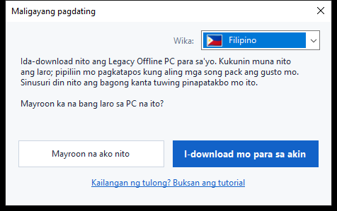
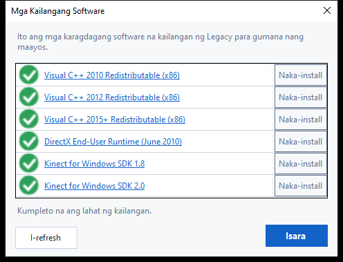
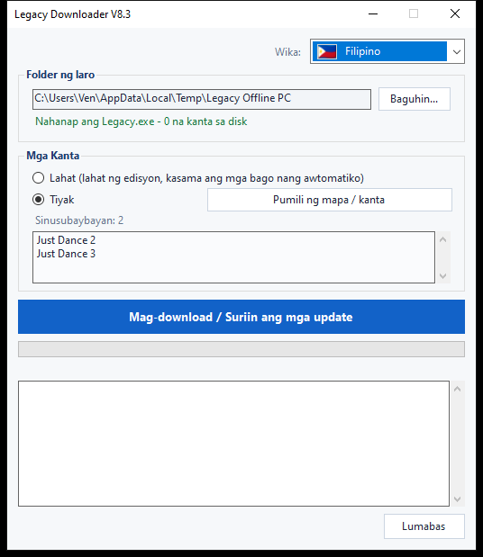
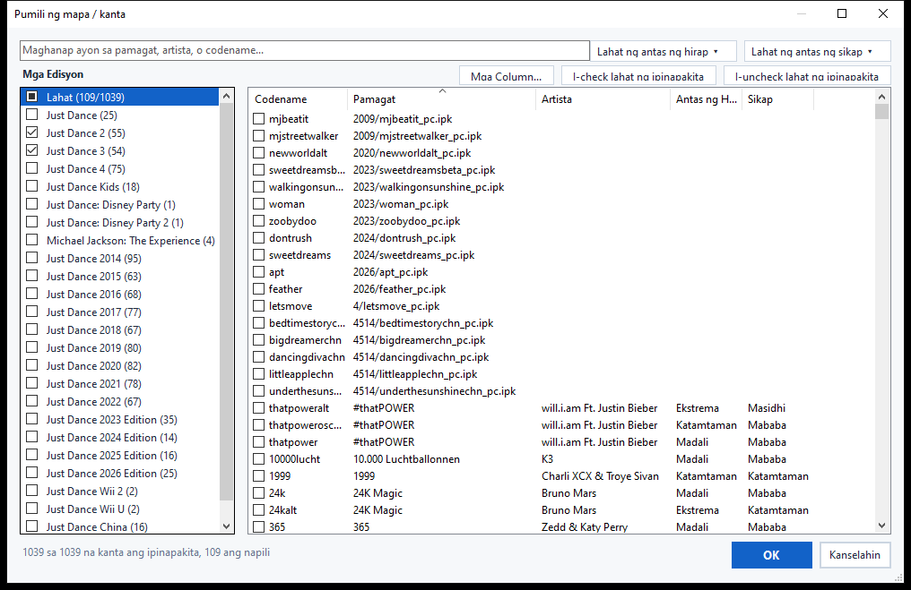
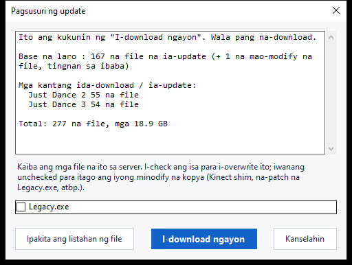

# Legacy Downloader — Tutorial

Ida-download ng Legacy Downloader ang **Legacy Offline PC** at ang mga song
pack nito sa iyong computer, at pinapanatili itong updated. Hindi mo
kailangan ng anumang teknikal na kaalaman para gamitin ito — sundan mo lang
ang mga larawan sa ibaba, sunod-sunod.

Ibang wika: [English](en.md) · [Français](fr.md) · [Español](es.md) ·
[Deutsch](de.md) · [Italiano](it.md) · [Português](pt.md) ·
[Nederlands](nl.md) · [日本語](ja.md) · [한국어](ko.md) ·
[简体中文](zh-Hans.md) · [繁體中文](zh-Hant.md) · [Русский](ru.md)

---

## Mabilisang gabay

Para sa gusto ng maikling bersyon lang:

1. I-download ang zip mula sa [Releases page](https://github.com/VenB304/LegacyDownloader/releases) at i-extract ito.
2. I-double-click ang `LegacyDownloader-GUI.bat`.
3. Sundan ang mga hakbang sa welcome screen, piliin ang iyong mga kanta, at
   i-click ang **"Mag-download / Suriin ang mga update"**.
4. Kapag lumabas ang "Handa ka na!", buksan ang `Legacy.exe` sa iyong folder
   ng laro para maglaro.

Kung may mukhang nakakalito o hindi tumutugma sa nakasaad, ang detalyadong
gabay sa ibaba ay may larawan para sa bawat screen.

---

## 1. I-download at i-extract

1. Kunin ang pinakabagong `LegacyDownloaderVX.zip` mula sa [Releases page](https://github.com/VenB304/LegacyDownloader/releases).
2. I-extract ito — right-click sa zip → **Extract All...** → pumili ng
   ordinaryong folder (okay lang ang Desktop). Huwag itong patakbuhin mula
   sa loob mismo ng zip window.
3. Buksan ang na-extract na folder at i-double-click ang
   **`LegacyDownloader-GUI.bat`**.


> Kung na-flag ng iyong antivirus ang `rclone.exe` (nasa loob ng folder na
> `bin`), tingnan ang seksyong [Pag-aayos ng Problema](#pag-aayos-ng-problema)
> sa ibaba — kilalang false positive iyon, hindi tunay na problema sa
> download.

## 2. Unang pagpapatakbo — Welcome screen

Lalabas ang isang window na **"Maligayang pagdating"** susunod.



- **Maling wika ang lumabas?** I-click ang flag dropdown sa sulok at piliin
  ang sa'yo — agad magbabago ang buong programa.
- Pagkatapos, sagutin ang tanging tanong na itatanong:
  - **"Mayroon na ako nito"** — piliin ito kung nasa PC na ito ang Legacy
    Offline PC.
  - **"I-download mo para sa akin"** — piliin ito kung wala ka pa nito.
    Awtomatiko na ang lahat pagkatapos nito.

### Kung mayroon ka nang laro
May lalabas na folder window. Hanapin at i-click ang folder na may
**`Legacy.exe`** direkta sa loob nito (hindi subfolder), pagkatapos ay
i-click ang **Select Folder**.

### Kung wala ka pang laro
May lalabas na folder window para pumili ka kung saan titira ang laro — isang
walang laman na folder, o bagong gawa mo doon mismo (may button na "New
Folder" sa window na iyon). I-click ang **Select Folder**, at agad na
magsisimula ang pag-download ng laro — walang dagdag na buton na pipindutin.

Malaki ang unang download na ito — mga **1.2 GB**, karaniwang 5 hanggang 20
minuto depende sa iyong internet. **Iwanang bukas ang window** hanggang
matapos; makikita mo ang progreso habang gumagalaw sa window.

> Hiwalay na hakbang ang mga kanta — ang unang download ay ang base na laro
> lamang, kaya huwag mag-alala kung wala pang lumabas na kanta.

## 3. Pagsuri sa mga kinakailangang software

Kailangan ng Legacy ng ilang karagdagang software na hindi kasama sa
Windows — Kinect SDKs at Visual C++ runtimes. Awtomatiko itong sinusuri ng
Legacy Downloader, minsan lang:

- **Kung mayroon ka nang laro**, agad mangyayari ang pagsuring ito, bago
  pa lumabas ang main window.
- **Kung pinili mo ang "I-download mo para sa akin"**, mangyayari ito
  awtomatiko kapag natapos na ang download sa itaas.



Ang anumang naka-mark na pula ay kulang — i-click ang **I-install** sa
tabi nito para i-download at i-install ito, o i-click ang naka-link na
pangalan para buksan sa halip ang opisyal na pahina ng download ng
Microsoft. Kapag berde na ang lahat, i-click ang **Isara** para magpatuloy.
Puwede mong buksan ulit ang pagsuring ito anumang oras mula sa buton na
**Requirements** sa main window.

## 4. Ang main window

Kapag nasa lugar na ang base na laro, dito ka makakarating:



- **Folder ng laro** — kung saan nakatira ang iyong laro. Pinapayagan ka ng
  **Baguhin...** na ituro ito sa ibang lugar kung ililipat mo ang laro balang
  araw.
- **Mga Kanta** — piliin ang gusto mo:
  - **Lahat** — bawat available na edisyon ng Just Dance, at kukunin nito
    ang mga bago nang awtomatiko habang idinadagdag ang mga ito. Ito ang
    pinakasimpleng opsyon kung hindi ka sigurado — piliin ito.
  - **Tiyak** — piliin sa halip ang eksaktong gusto mo. I-click ang
    **Pumili ng mapa / kanta** para buksan ang picker — tatalakayin sa
    susunod na hakbang.
- **Mag-download / Suriin ang mga update** — ang malaking buton. I-click
  ito para kunin ang napili mo, at i-click ulit anumang oras mamaya para
  suriin ang bagong kanta o update.
- **Requirements** — binubuksan ulit ang pagsuri mula sa nakaraang hakbang,
  anumang oras na gusto mong suriin ulit o i-install ang nalaktawan mo.

## 5. Pagpili ng indibidwal na kanta

I-click ang **Pumili ng mapa / kanta** (mula sa main window, anumang oras)
para buksan ang picker:



- **Mga Edisyon**, sa kaliwa — i-check ang checkbox ng buong edisyon para
  kunin ang lahat dito. Ang checkbox na parang kalahati lang ang puno ay
  nangangahulugang ilan lang sa mga kanta ng edisyong iyon ang napili.
- **Mga Kanta**, sa kanan — bawat indibidwal na kanta, kasama ang edisyon,
  antas ng hirap, at sikap (intensity ng ehersisyo) nito kung alam. I-check
  o i-uncheck ang anumang kanta nang mag-isa — hindi kailangang kunin ang
  buong edisyon nang sabay-sabay.
- **Maghanap** — mag-type ng pamagat, artista, o codename para agad
  i-filter ang listahan.
- **Mga Filter** — paliitin pa ang listahan ayon sa Antas ng Hirap o Sikap
  gamit ang mga dropdown sa kanang-itaas na sulok.
- **I-check lahat ng ipinapakita / I-uncheck lahat ng ipinapakita** —
  piliin nang sabay-sabay ang anumang ipinapakita ng iyong kasalukuyang
  paghahanap o filter, sa halip na mag-click nang isa-isa.
- **Mga Column...** — ipakita o itago ang mga column na Artista, Antas ng
  Hirap, o Sikap kung gusto mo ng mas simpleng tingin.

I-click ang **OK** para i-save ang mga pinili mo, o **Kanselahin** para
umatras nang hindi nagbabago ng anuman.

> Ang mga kantang wala pang pangalan sa listahan ng komunidad ay lumalabas
> pa rin (may filename na lang sa halip na pamagat) — mada-download at
> gagana pa rin ang mga ito, wala lang magandang pangalan hanggang
> may magdagdag nito.

## 6. Pagsusuri ng mga update

Ang pag-click sa malaking buton ay hindi agad nagda-download — muna
nitong **sinusuri** kung ano ang kulang o nagbago. Habang sinusuri, maaaring
umuusad lang ang progress bar pabalik-balik nang walang porsyento — normal
ito, ibig sabihin ay pinapaghambing pa nito ang iyong mga file sa server,
hindi na-stuck.



Kapag tapos na ang pagsusuri, maglilista ang isang window ng nahanap nito,
kasama ang kabuuang laki. I-click ang **I-download ngayon** para talagang
kunin ang mga file, o **Kanselahin** kung gusto mo lang tingnan ang
available. Kung walang nagbago mula noong huling beses, sasabihin lang
nitong **"Updated na ang lahat"** at hihinto doon — walang ii-click.

<details>
<summary>Kung na-modify mo ang mga file ng iyong laro (Kinect mod, na-patch na exe) — i-click para i-expand</summary>

Kung ang isang file na personal mong binago (`Legacy.exe` o isang DLL ng
Kinect) ay kaiba sa bersyon ng server, may sarili itong checkbox sa halip
na awtomatikong isasama:
- **Naka-check** = palitan ito ng kopya ng server (piliin ito kung wala
  kang minodify — normal na update lang ito ng laro).
- **Naka-uncheck** = itago ang sarili mong kopya gaya ng kalagayan nito.

Ang iyong mga setting sa laro (resolution, windowed/fullscreen) ay hindi
kailanman ginagalaw ng update, minodify man o hindi.
</details>

## 7. Habang nagda-download

Ang progress bar at ang log box sa ibaba nito ay nag-a-update nang live —
makikita mong nakalista ang laro at bawat song pack habang natatapos, isa-isa.
**Huwag isara ang window habang tumatakbo ito.** Kapag tapos na ang lahat,
makikita mo ito:

> **Handa ka na!** Buksan ang `Legacy.exe` sa iyong folder ng laro para
> maglaro.

Iyon ang kumpirmasyon mo na gumana ito — simulan mo na ang laro.

## 8. Pagbalik mamaya para sa bagong kanta

Patakbuhin lang ulit ang `LegacyDownloader-GUI.bat` anumang oras. Naaalala
nito ang iyong folder at ang mga pinili mong kanta, at ang pag-click sa
**Mag-download / Suriin ang mga update** ay kukunin ang anumang bago mula
noong huli mong pagbisita.

- **Magdagdag o mag-alis ng kanta**: i-click ulit ang **Pumili ng mapa / kanta**,
  i-check o i-uncheck ang anumang gusto mo, at i-click ang OK.
  Ang pag-uncheck ng isang bagay na na-download mo na — buong edisyon man o
  ilang kanta lang — ay magtatanong kung burahin din ang mga file na iyon,
  o itigil na lang ang pagkuha ng update para sa mga ito habang itinatago
  ang mayroon ka na.
- **Baguhin ang wika**: ang flag dropdown, sa kanang-itaas, anumang oras.

---

## Bersyong text/console (advanced — hindi kailangan ng karamihan)

May bersyon din na plain text-menu, para sa pag-aayos ng problema o kung
mas gusto mo ito: i-double-click na lang ang
**`LegacyDownloader-Console.bat`** sa halip. Parehong feature, na-navigate
gamit ang number keys:

```
[1] Mag-download / suriin ang bagong kanta
[2] Piliin kung aling mga kanta ang kukunin
[3] Baguhin ang folder ng laro
[4] Wika
[5] Suriin ang mga kailangang software
[6] Lumabas
```

> **Tala tungkol sa font:** ipinapakita nang tama ng graphical na bersyon
> ang bawat wika. Kailangan ng text na bersyong ito ng font na may tamang
> mga karakter — maaaring magpakita bilang mga kahon (□) ang Japanese,
> Korean, Chinese, at Russian dito. Kung gusto mo ang isa sa mga wikang
> iyon, gamitin na lang ang regular na graphical na bersyon.

---

## Pag-aayos ng Problema

- **Kina-quarantine o binubura ng antivirus ang `rclone.exe`** — kilalang
  false positive. Nag-fla-flag ang ilang antivirus sa `rclone` bilang
  "hacktool" dahil ginagamit din ito ng mga attacker, pero lehitimo at
  malawakang ginagamit na open-source tool ito, at ito lang ang ginagamit
  ng program na ito para kunin ang mga file. I-restore ito mula sa
  quarantine/history ng iyong antivirus, payagan ito, pagkatapos ay
  patakbuhin ulit ang `LegacyDownloader-GUI.bat`.
- **May lumalabas na security warning kapag dini-double-click ang
  `LegacyDownloader-GUI.bat`** — nangyayari ito minsan sa unang pagpapatakbo
  ng anumang na-download na script. I-click lang para magpatuloy ("More
  info → Run anyway", o katulad nito) — normal ito para sa maliit at
  independiyenteng gawang tool, hindi senyales na may mali.
- **Mensaheng "rclone.exe is missing"** — i-download ulit ang zip at
  i-extract muli; huwag patakbuhin ang tool mula sa loob ng zip viewer.
- **Walang nangyayari kapag nag-click ako ng folder button** — baka
  nagbukas ang picker window *sa likod* ng main window; tingnan ang iyong
  taskbar.
- **Sinasabing "updated" pero kulang ako ng kanta** — buksan ang
  **Pumili ng mapa / kanta** at tingnan kung na-check mo talaga ang mga
  gusto mo (o piliin ang **"Lahat"**).
- **Natitigil pa rin?** Mag-post sa Legacy Downloader thread sa Discord na
  may screenshot ng nakikita mo at kung aling hakbang ka — may tutulong
  sa'yo.
