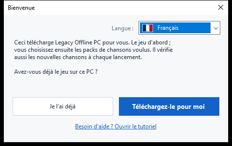
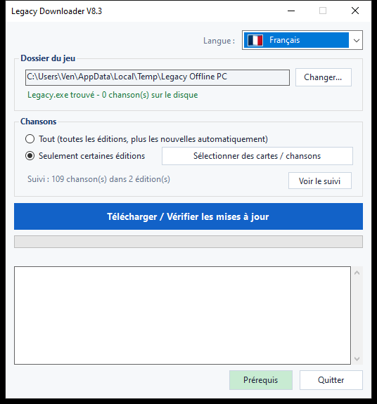
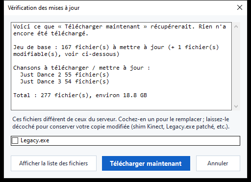

# Legacy Downloader — Tutoriel

Legacy Downloader installe **Legacy Offline PC** et ses packs de chansons sur
votre ordinateur, et les maintient à jour. Aucune connaissance technique
n'est nécessaire — suivez simplement les images ci-dessous, dans l'ordre.

Autres langues : [English](en.md) · [Español](es.md) · [Deutsch](de.md) ·
[Italiano](it.md) · [Português](pt.md) · [Nederlands](nl.md) · [日本語](ja.md) ·
[한국어](ko.md) · [简体中文](zh-Hans.md) · [繁體中文](zh-Hant.md) · [Русский](ru.md)

---

## Démarrage rapide

Pour ceux qui veulent juste la version courte :

1. Téléchargez le zip depuis la [page des Releases](../../releases) et
   extrayez-le.
2. Double-cliquez sur `LegacyDownloader.bat`.
3. Suivez les étapes de l'écran de bienvenue, choisissez vos chansons, puis
   cliquez sur **« Télécharger / Vérifier les mises à jour »**.
4. Quand le message **« Vous êtes à jour »** apparaît, ouvrez `Legacy.exe`
   dans votre dossier de jeu pour jouer.

Si quelque chose vous semble confus ou ne correspond pas à ce qui est
décrit, le guide détaillé ci-dessous contient une image pour chaque écran.

---

## 1. Télécharger et extraire

1. Récupérez le dernier `LegacyDownloaderVX.zip` depuis la [page des Releases](../../releases).
2. Extrayez-le — clic droit sur le zip → **Extraire tout...** → choisissez
   un dossier normal (le Bureau convient). Ne l'exécutez pas depuis
   l'intérieur de la fenêtre du zip.
3. Ouvrez le dossier extrait et double-cliquez sur **`LegacyDownloader.bat`**.


> Si votre antivirus signale `rclone.exe` (un fichier dans ce dossier),
> consultez la section [Dépannage](#dépannage) ci-dessous — c'est un faux
> positif connu, pas un vrai problème avec le téléchargement.

## 2. Premier lancement — écran de bienvenue

Une fenêtre **« Bienvenue »** apparaît ensuite.



- **Mauvaise langue affichée ?** Cliquez sur le menu déroulant du drapeau
  dans le coin et choisissez la vôtre — le programme change instantanément.
- Répondez ensuite à la seule question posée :
  - **« Je l'ai déjà »** — choisissez ceci si Legacy Offline PC est déjà
    quelque part sur ce PC.
  - **« Téléchargez-le pour moi »** — choisissez ceci si vous n'avez pas
    encore le jeu. Tout ce qui suit est automatique.

### Si vous avez déjà le jeu
Une fenêtre de sélection de dossier s'ouvre. Trouvez et cliquez sur le
dossier qui contient **`Legacy.exe`** directement à l'intérieur (pas un
sous-dossier), puis cliquez sur **Sélectionner un dossier**.

### Si vous n'avez pas encore le jeu
Une fenêtre de sélection de dossier s'ouvre pour choisir où le jeu doit
vivre — un dossier vide, ou un nouveau que vous créez sur place (il y a un
bouton « Nouveau dossier » dans cette fenêtre). Cliquez sur **Sélectionner
un dossier**, et le téléchargement du jeu démarre immédiatement — aucun
bouton supplémentaire à presser.

Ce premier téléchargement est volumineux — environ **1,2 Go**, généralement
entre 5 et 20 minutes selon votre connexion. **Laissez la fenêtre ouverte**
jusqu'à la fin ; la progression s'affiche dans la fenêtre.

> Les chansons ne font **pas** partie de ce premier téléchargement — c'est
> uniquement le jeu de base ; ne vous inquiétez donc pas si aucune chanson
> n'apparaît encore.

## 3. La fenêtre principale

Une fois le jeu de base en place, vous arrivez ici :



- **Dossier du jeu** — où vit votre jeu. **Changer...** permet de le
  pointer ailleurs si vous déplacez le jeu un jour.
- **Chansons** — choisissez :
  - **Tout** — toutes les éditions Just Dance disponibles, avec récupération
    automatique des nouvelles au fur et à mesure de leur sortie. C'est
    l'option la plus simple si vous n'êtes pas sûr — choisissez celle-ci.
  - **Seulement certaines éditions** — cliquez sur **« Choisir les
    éditions... »** pour cocher uniquement les jeux que vous voulez
    vraiment (par exemple, seulement *Just Dance 2019*), si vous préférez
    ne pas tout télécharger.
- **« Télécharger / Vérifier les mises à jour »** — le gros bouton.
  Cliquez dessus pour récupérer ce que vous avez choisi, et cliquez à
  nouveau plus tard pour vérifier les nouvelles chansons ou mises à jour.

## 4. Vérification des mises à jour

Cliquer sur le gros bouton ne télécharge rien immédiatement — il
**vérifie** d'abord ce qui manque ou a changé. Pendant la vérification, la
barre de progression peut simplement aller et venir sans pourcentage
affiché — c'est normal, cela veut dire qu'elle compare encore vos fichiers
avec le serveur, pas qu'elle est bloquée.



Une fois la vérification terminée, une fenêtre liste ce qui a été trouvé,
avec une taille totale. Cliquez sur **« Télécharger maintenant »** pour
récupérer les fichiers, ou **« Annuler »** si vous vouliez juste voir ce qui
est disponible. Si rien n'a changé depuis la dernière fois, elle indique
simplement **« Tout est déjà à jour »** et s'arrête là — rien à cliquer.

<details>
<summary>Si vous avez modifié vos fichiers de jeu (mod Kinect, exe patché) — cliquez pour développer</summary>

Si un fichier que vous avez personnellement modifié (`Legacy.exe` ou une
DLL Kinect) diffère de la version du serveur, il reçoit sa propre case à
cocher au lieu d'être inclus automatiquement :
- **Coché** = remplacer par la copie du serveur (choisissez ceci si vous
  n'avez rien moddé — c'est juste une mise à jour normale du jeu).
- **Décoché** = conserver votre propre copie telle quelle.

Vos réglages en jeu (résolution, plein écran/fenêtré) ne sont jamais
touchés par une mise à jour, moddée ou non.
</details>

## 5. Pendant le téléchargement

La barre de progression et le journal en dessous se mettent à jour en
direct — vous verrez le jeu et chaque pack de chansons listés au fur et à
mesure qu'ils se terminent, un par un. **Ne fermez pas la fenêtre pendant
que cela s'exécute.** Une fois tout terminé, vous verrez :

> **Vous êtes à jour. Ouvrez Legacy.exe dans votre dossier de jeu pour
> jouer.**

C'est votre confirmation que tout a fonctionné — allez lancer le jeu.

## 6. Revenir plus tard pour de nouvelles chansons

Relancez simplement `LegacyDownloader.bat` à tout moment. Il se souvient de
votre dossier et de vos choix de chansons, et cliquer sur **« Télécharger /
Vérifier les mises à jour »** récupère tout ce qui est nouveau depuis votre
dernière visite.

- **Ajouter ou retirer des chansons** : utilisez à nouveau **« Choisir les
  éditions... »**. Décocher un jeu déjà téléchargé demande si vous voulez
  aussi supprimer ces fichiers, ou juste arrêter de recevoir ses mises à
  jour tout en gardant ce que vous avez.
- **Changer de langue** : le menu déroulant du drapeau, en haut à droite, à
  tout moment.

---

## Version texte/console (avancé — la plupart des gens n'en ont pas besoin)

Il existe aussi une version en menu texte, pour le dépannage ou si vous la
préférez : double-cliquez sur **`LegacyDownloader-Console.bat`** à la
place. Mêmes fonctionnalités, navigation avec les touches numériques :

```
[1] Télécharger / vérifier les nouvelles chansons
[2] Choisir les chansons à récupérer
[3] Changer le dossier du jeu
[4] Langue
[5] Quitter
```

> **Remarque sur la police :** la version graphique affiche correctement
> toutes les langues. Cette version texte a besoin d'une police avec les
> bons caractères — le japonais, le coréen, le chinois et le russe peuvent
> apparaître sous forme de carrés (□) ici. Si vous voulez l'une de ces
> langues, restez sur la version graphique.

---

## Dépannage

- **L'antivirus met `rclone.exe` en quarantaine ou le supprime** — un faux
  positif connu. Certains antivirus signalent `rclone` comme un « outil de
  piratage » car des attaquants peuvent aussi l'utiliser, mais c'est un
  outil open-source légitime et largement utilisé, et c'est le seul moyen
  utilisé par ce programme pour récupérer les fichiers. Restaurez-le depuis
  la quarantaine/l'historique de votre antivirus, autorisez-le, puis
  relancez `LegacyDownloader.bat`.
- **Un avertissement de sécurité apparaît quand vous double-cliquez sur
  `LegacyDownloader.bat`** — cela peut arriver la première fois que vous
  exécutez un script téléchargé. Cliquez pour continuer (« Informations
  complémentaires → Exécuter quand même », ou une formulation similaire) —
  c'est normal pour un petit outil indépendant, pas un signe de problème.
- **Message « rclone.exe est manquant »** — retéléchargez le zip et
  extrayez-le à nouveau ; n'exécutez pas l'outil depuis l'intérieur de la
  fenêtre du zip.
- **Rien ne se passe quand je clique sur un bouton de dossier** — la
  fenêtre de sélection s'est peut-être ouverte *derrière* la fenêtre
  principale ; vérifiez votre barre des tâches.
- **Il dit « à jour » mais il me manque des chansons** — ouvrez **« Choisir
  les éditions... »** et vérifiez que vous avez bien sélectionné celles que
  vous voulez (ou choisissez **« Tout »**).
- **Toujours bloqué ?** Postez dans le fil Legacy Downloader sur Discord
  avec une capture d'écran de ce que vous voyez et à quelle étape vous
  êtes — quelqu'un vous aidera.
