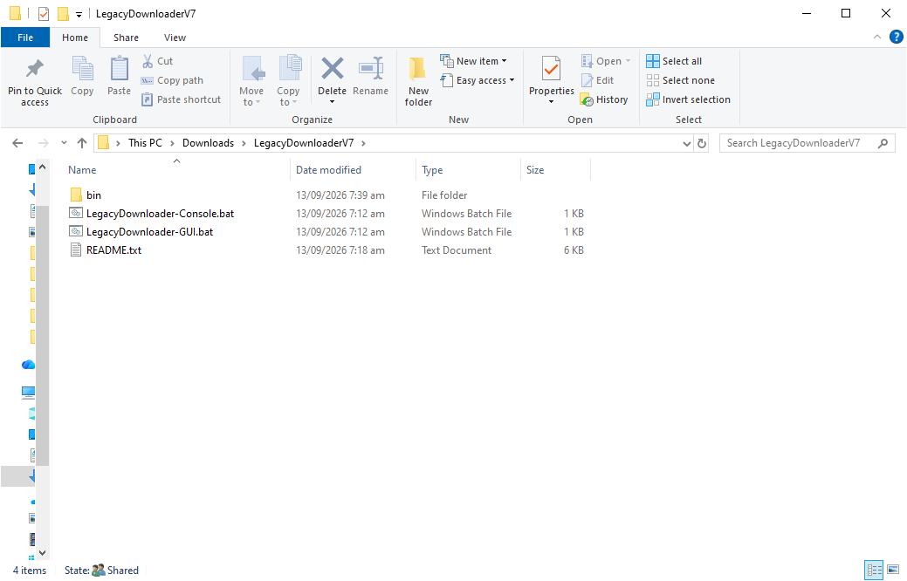
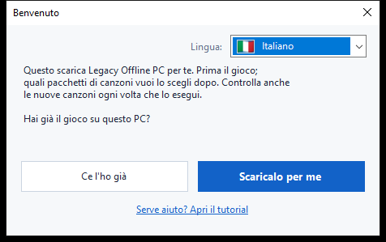
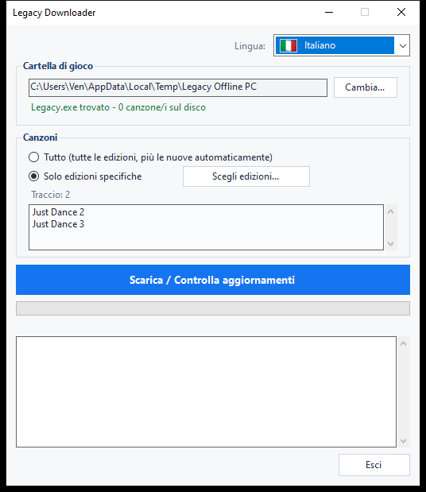
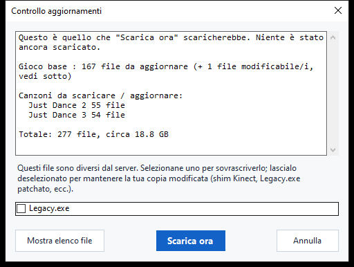

# Legacy Downloader — Tutorial

Legacy Downloader scarica **Legacy Offline PC** e i pacchetti di canzoni sul
tuo computer e li mantiene aggiornati. Non serve alcuna conoscenza tecnica
per usarlo — segui semplicemente le immagini qui sotto, in ordine.

Altre lingue: [English](en.md) · [Français](fr.md) · [Español](es.md) ·
[Deutsch](de.md) · [Português](pt.md) · [Nederlands](nl.md) · [日本語](ja.md) ·
[한국어](ko.md) · [简体中文](zh-Hans.md) · [繁體中文](zh-Hant.md) · [Русский](ru.md)

---

## Avvio rapido

Per chi vuole solo la versione breve:

1. Scarica lo zip dalla [pagina Releases](../../releases) ed estrailo.
2. Fai doppio clic su `LegacyDownloader.bat`.
3. Segui i passaggi della schermata di benvenuto, scegli le tue canzoni e
   fai clic su **"Scarica / Controlla aggiornamenti"**.
4. Quando appare "Sei aggiornato!", apri `Legacy.exe` nella tua cartella di
   gioco per giocare.

Se qualcosa ti sembra confuso o non corrisponde a quanto descritto, la
guida dettagliata qui sotto ha un'immagine per ogni schermata.

---

## 1. Scaricare ed estrarre

1. Prendi l'ultimo `LegacyDownloaderVX.zip` dalla [pagina Releases](../../releases).
2. Estrailo — clic destro sullo zip → **Estrai tutto...** → scegli una
   cartella normale (va bene il Desktop). Non eseguirlo dall'interno della
   finestra dello zip.
3. Apri la cartella estratta e fai doppio clic su
   **`LegacyDownloader.bat`**.



> Se il tuo antivirus segnala `rclone.exe` (un file dentro questa
> cartella), guarda la sezione [Risoluzione dei problemi](#risoluzione-dei-problemi)
> qui sotto — è un falso positivo noto, non un vero problema con il
> download.

## 2. Primo avvio — schermata di benvenuto

Successivamente appare una finestra **"Benvenuto"**.



- **Compare la lingua sbagliata?** Fai clic sul menu a tendina della
  bandiera nell'angolo e scegli la tua — tutto il programma cambia
  all'istante.
- Poi rispondi all'unica domanda posta:
  - **"Ce l'ho già"** — scegli questo se Legacy Offline PC è già da
    qualche parte su questo PC.
  - **"Scaricalo per me"** — scegli questo se non hai ancora il gioco.
    Tutto quello che segue è automatico.

### Se hai già il gioco
Si apre una finestra di selezione cartella. Trova e clicca la cartella che
contiene **`Legacy.exe`** direttamente al suo interno (non in una
sottocartella), poi fai clic su **Seleziona cartella**.

### Se non hai ancora il gioco
Si apre una finestra di selezione cartella per scegliere dove deve vivere
il gioco — una cartella vuota, o una nuova che crei lì (c'è un pulsante
"Nuova cartella" in quella finestra). Fai clic su **Seleziona cartella**, e
il download del gioco parte subito — nessun altro pulsante da premere.

Questo primo download è grande — circa **1,2 GB**, solitamente tra 5 e
20 minuti a seconda della tua connessione. **Lascia la finestra aperta**
finché non finisce; vedrai l'avanzamento nella finestra.

> Le canzoni non fanno parte di questo primo download — è solo il gioco
> base, quindi non preoccuparti se non compare ancora nessuna canzone.

## 3. La finestra principale

Una volta che il gioco base è a posto, arrivi qui:



- **Cartella di gioco** — dove vive il tuo gioco. **Cambia...** ti
  permette di puntare altrove se un giorno sposti il gioco.
- **Canzoni** — scegli:
  - **Tutto** — ogni edizione Just Dance disponibile, e prenderà
    automaticamente quelle nuove più avanti. Questa è l'opzione più
    semplice se non sei sicuro — scegli questa.
  - **Solo edizioni specifiche** — fai clic su **"Scegli edizioni..."**
    per selezionare solo i giochi che vuoi davvero (per esempio, solo
    *Just Dance 2019*), se preferisci non scaricare tutto.
- **"Scarica / Controlla aggiornamenti"** — il pulsante grande. Fai clic
  per ottenere quello che hai scelto, e clicca di nuovo più avanti per
  controllare nuove canzoni o aggiornamenti.

## 4. Controllo aggiornamenti

Cliccare il pulsante grande non scarica subito nulla — prima **controlla**
cosa manca o è cambiato. Durante il controllo, la barra di avanzamento può
semplicemente muoversi avanti e indietro senza percentuale — è normale,
significa solo che sta ancora confrontando i tuoi file con il server, non
che sia bloccata.



Una volta finito il controllo, una finestra elenca cosa è stato trovato,
con una dimensione totale. Fai clic su **"Scarica ora"** per ottenere
davvero i file, o su **"Annulla"** se volevi solo vedere cosa è
disponibile. Se non è cambiato nulla dall'ultima volta, dice semplicemente
**"Tutto è già aggiornato"** e si ferma lì — niente da cliccare.

<details>
<summary>Se hai modificato i tuoi file di gioco (mod Kinect, exe patchato) — clicca per espandere</summary>

Se un file che hai modificato personalmente (`Legacy.exe` o una DLL
Kinect) è diverso dalla versione del server, riceve una propria casella di
controllo invece di essere incluso automaticamente:
- **Selezionata** = sostituiscilo con la copia del server (scegli questo
  se non hai modificato nulla — è solo un normale aggiornamento del
  gioco).
- **Non selezionata** = mantieni la tua copia così com'è.

Le tue impostazioni di gioco (risoluzione, finestra/schermo intero) non
vengono mai toccate da un aggiornamento, modificato o no.
</details>

## 5. Durante il download

La barra di avanzamento e il registro sottostante si aggiornano in tempo
reale — vedrai il gioco e ogni pacchetto di canzoni elencati man mano che
finiscono, uno alla volta. **Non chiudere la finestra mentre questo è in
corso.** Quando tutto è finito, vedrai:

> **Sei aggiornato! Apri Legacy.exe nella tua cartella di gioco per
> giocare.**

Questa è la tua conferma che ha funzionato — vai ad avviare il gioco.

## 6. Tornare più tardi per nuove canzoni

Esegui semplicemente di nuovo `LegacyDownloader.bat` in qualsiasi momento.
Ricorda la tua cartella e le tue scelte di canzoni, e cliccare su
**"Scarica / Controlla aggiornamenti"** prende tutto ciò che è nuovo dalla
tua ultima visita.

- **Aggiungere o rimuovere canzoni**: usa di nuovo **"Scegli edizioni..."**.
  Deselezionare un gioco già scaricato chiederà se eliminare anche quei
  file, o solo smettere di riceverne gli aggiornamenti tenendo ciò che
  hai.
- **Cambiare lingua**: il menu a tendina della bandiera, in alto a destra,
  in qualsiasi momento.

---

## Versione testo/console (avanzato — la maggior parte non ne ha bisogno)

Esiste anche una versione a menu testuale, per la risoluzione dei problemi
o se la preferisci: fai doppio clic su
**`LegacyDownloader-Console.bat`** invece. Stesse funzionalità, navigazione
con i tasti numerici:

```
[1] Scarica / controlla nuove canzoni
[2] Scegli le canzoni da scaricare
[3] Cambia cartella di gioco
[4] Lingua
[5] Esci
```

> **Nota sul font:** la versione grafica mostra correttamente tutte le
> lingue. Questa versione testuale ha bisogno di un font con i caratteri
> giusti — giapponese, coreano, cinese e russo possono apparire come
> quadratini (□) qui. Se vuoi una di queste lingue, resta sulla versione
> grafica.

---

## Risoluzione dei problemi

- **L'antivirus mette in quarantena o elimina `rclone.exe`** — un falso
  positivo noto. Alcuni antivirus segnalano `rclone` come "hacktool"
  perché anche gli attaccanti possono usarlo, ma è uno strumento
  open-source legittimo e ampiamente usato, ed è l'unica cosa che questo
  programma usa per recuperare i file. Ripristinalo dalla
  quarantena/cronologia del tuo antivirus, consentilo, poi riavvia
  `LegacyDownloader.bat`.
- **Compare un avviso di sicurezza quando fai doppio clic su
  `LegacyDownloader.bat`** — può succedere la prima volta che esegui uno
  script scaricato. Clicca per procedere ("Ulteriori informazioni →
  Esegui comunque", o una dicitura simile) — è normale per un piccolo
  strumento indipendente, non un segno che qualcosa non va.
- **Messaggio "rclone.exe mancante"** — riscarica lo zip ed estrailo di
  nuovo; non eseguire lo strumento dall'interno del visualizzatore zip.
- **Non succede nulla quando clicco un pulsante di cartella** — la
  finestra di selezione potrebbe essersi aperta *dietro* quella
  principale; controlla la barra delle applicazioni.
- **Dice "aggiornato" ma mi mancano canzoni** — apri **"Scegli
  edizioni..."** e controlla di aver davvero selezionato quelle che vuoi
  (o scegli **"Tutto"**).
- **Ancora bloccato?** Scrivi nel thread di Legacy Downloader su Discord
  con uno screenshot di cosa vedi e a che punto sei arrivato — qualcuno
  ti aiuterà.
