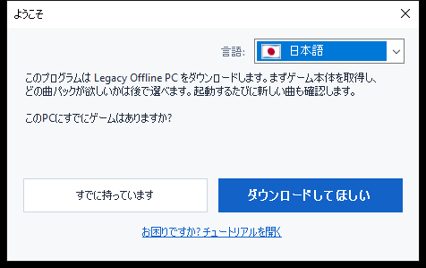
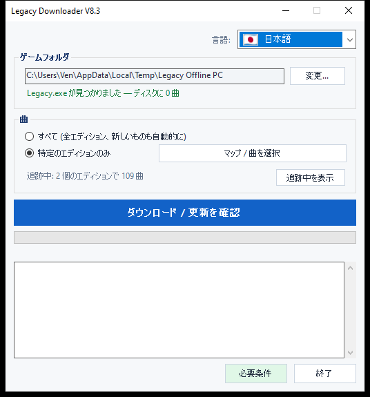
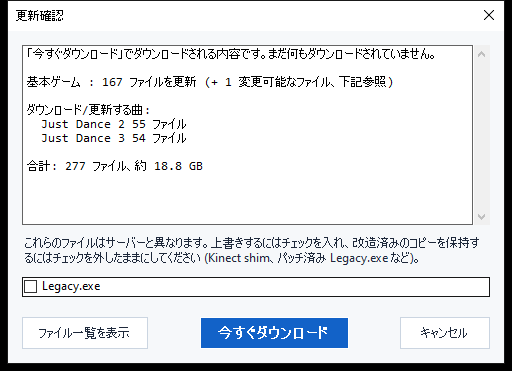

# Legacy Downloader — チュートリアル

Legacy Downloader は **Legacy Offline PC** と曲パックをパソコンにダウンロードし、
最新の状態に保つツールです。専門的な知識は一切必要ありません — 以下の画像の順番に
沿って進めるだけです。

他の言語: [English](en.md) · [Français](fr.md) · [Español](es.md) ·
[Deutsch](de.md) · [Italiano](it.md) · [Português](pt.md) · [Nederlands](nl.md) ·
[한국어](ko.md) · [简体中文](zh-Hans.md) · [繁體中文](zh-Hant.md) · [Русский](ru.md)

---

## クイックスタート

とにかく手短に済ませたい方向けです。

1. [Releases ページ](https://github.com/VenB304/LegacyDownloader/releases) から zip をダウンロードして展開します。
2. `LegacyDownloader.bat` をダブルクリックします。
3. ようこそ画面の手順に沿って進み、曲を選び、**「ダウンロード / 更新を確認」**を
   クリックします。
4. 「準備完了です!」と表示されたら、ゲームフォルダの `Legacy.exe` を開いて
   プレイしてください。

わかりにくい部分や説明と違う画面が出てきた場合は、下の詳しい手順に各画面の
スクリーンショットがあります。

---

## 1. ダウンロードして展開する

1. [Releases ページ](https://github.com/VenB304/LegacyDownloader/releases) から最新の `LegacyDownloaderVX.zip` を
   入手します。
2. 展開します — zip を右クリック → **すべて展開...** → 通常のフォルダを選びます
   (デスクトップで構いません)。zip ウィンドウの中から直接実行しないでください。
3. 展開したフォルダを開き、**`LegacyDownloader.bat`** をダブルクリックします。


> ウイルス対策ソフトが `rclone.exe`(このフォルダ内のファイル)を検出した場合は、
> 下の[トラブルシューティング](#トラブルシューティング)を参照してください —
> よくある誤検知で、ダウンロード自体の問題ではありません。

## 2. 初回起動 — ようこそ画面

次に**「ようこそ」**ウィンドウが表示されます。



- **違う言語が表示されている場合** — 隅の国旗のドロップダウンをクリックして
  自分の言語を選んでください。プログラム全体が即座に切り替わります。
- 次に、表示される1つの質問に答えます。
  - **「すでに持っています」** — Legacy Offline PC がすでにこのPCのどこかに
    ある場合に選びます。
  - **「ダウンロードしてほしい」** — まだゲームを持っていない場合に選びます。
    以降はすべて自動で進みます。

### すでにゲームを持っている場合
フォルダ選択ウィンドウが開きます。**`Legacy.exe`** が直接入っているフォルダ
(サブフォルダではなく)を見つけてクリックし、**フォルダーの選択**をクリック
します。

### まだゲームを持っていない場合
フォルダ選択ウィンドウが開き、ゲームを保存する場所を選べます — 空のフォルダ
か、そこで新しく作成したフォルダです(ウィンドウ内に「新しいフォルダー」
ボタンがあります)。**フォルダーの選択**をクリックすると、ゲームのダウンロード
がすぐに始まります — 追加のボタン操作は不要です。

この最初のダウンロードは大きく — 約 **1.2 GB**、通常はインターネット回線に
よって5〜20分ほどかかります。終わるまで**ウィンドウを開いたままにして
ください** — ウィンドウ内で進行状況が動いているのが見えます。

> 曲はこの最初のダウンロードには含まれません — これはゲーム本体だけなので、
> まだ曲が表示されなくても心配ありません。

## 3. メインウィンドウ

ゲーム本体の準備ができると、ここに到達します。



- **ゲームフォルダ** — ゲームが保存されている場所です。ゲームをいつか移動
  した場合は**変更...**で別の場所を指定できます。
- **曲** — 選択します。
  - **すべて** — 利用可能なすべての Just Dance エディションを取得し、後で
    追加されるものも自動的に取得します。迷ったらこれが一番シンプルな
    選択肢です — これを選んでください。
  - **特定のエディションのみ** — 本当に欲しいゲームだけにチェックを入れたい
    場合(例えば *Just Dance 2019* だけなど)は、**「エディションを選択...」**
    をクリックします。
- **「ダウンロード / 更新を確認」** — 大きなボタンです。クリックすると
  選んだものを取得し、後で再度クリックすると新しい曲や更新を確認できます。

## 4. 更新の確認

大きなボタンをクリックしても、すぐにはダウンロードされません — まず何が
不足しているか、変更されたかを**確認**します。確認中は、進行状況バーが
パーセント表示なしで単に行き来することがあります — これは正常で、まだ
サーバーとファイルを比較していることを意味し、フリーズしているわけでは
ありません。



確認が終わると、見つかった内容と合計サイズが表示されたウィンドウが出ます。
実際にファイルを取得するには**「今すぐダウンロード」**を、何が利用可能かを
見たかっただけなら**「キャンセル」**をクリックします。前回から何も変わって
いなければ、単に**「すべて最新の状態です」**と表示されてそこで終わります —
クリックするものはありません。

<details>
<summary>ゲームファイルを改造している場合(Kinect mod、パッチ済み exe など) — クリックして展開</summary>

自分で変更したファイル(`Legacy.exe` や Kinect DLL)がサーバーのバージョンと
異なる場合、自動的にまとめて処理されるのではなく、専用のチェックボックスが
表示されます。

- **チェックあり** = サーバーのコピーで置き換える(改造していない場合は
  これを選んでください — 通常のゲーム更新にすぎません)。
- **チェックなし** = 自分のコピーをそのまま保持する。

ゲーム内の設定(解像度、ウィンドウ/フルスクリーン)は、改造の有無に
かかわらず、更新によって触れられることはありません。
</details>

## 5. ダウンロード中

進行状況バーと下のログ欄はリアルタイムで更新されます — ゲーム本体と各曲
パックが完了するたびに、1つずつ表示されます。**実行中はウィンドウを
閉じないでください。** すべて完了すると、次のように表示されます。

> **準備完了です! ゲームフォルダの Legacy.exe を開いてプレイしてください。**

これが成功した証拠です — ゲームを起動しましょう。

## 6. 後で新しい曲を確認する

いつでも `LegacyDownloader.bat` を再度実行するだけです。フォルダと曲の選択
内容は記憶されており、**「ダウンロード / 更新を確認」**をクリックすると、
前回の訪問以降に追加されたものをすべて取得できます。

- **曲の追加・削除**: 再度**「エディションを選択...」**を使います。すでに
  ダウンロード済みのゲームのチェックを外すと、そのファイルも削除するか、
  手元に残したまま更新だけ停止するかを尋ねられます。
- **言語の変更**: 右上の国旗のドロップダウンから、いつでも変更できます。

---

## テキスト/コンソール版(上級者向け — ほとんどの人には不要です)

トラブルシューティング用、または好みに応じてテキストメニュー版もあります。
代わりに**`LegacyDownloader-Console.bat`**をダブルクリックしてください。
機能は同じで、数字キーで操作します。

```
[1] ダウンロード / 新しい曲を確認
[2] 取得する曲を選択
[3] ゲームフォルダを変更
[4] 言語
[5] 終了
```

> **フォントについての注記:** グラフィカル版はすべての言語を正しく表示
> します。このテキスト版は正しい文字を表示できるフォントが必要です —
> 日本語、韓国語、中国語、ロシア語はここでは四角(□)として表示される
> ことがあります。これらの言語を使いたい場合は、グラフィカル版を
> ご利用ください。

---

## トラブルシューティング

- **ウイルス対策ソフトが `rclone.exe` を隔離または削除する** — よくある
  誤検知です。一部のウイルス対策ソフトは、攻撃者も使用できるという理由で
  `rclone` を「ハッキングツール」として検出しますが、これは正規の、広く
  使われているオープンソースツールであり、このプログラムがファイルを
  取得するために使う唯一の手段です。ウイルス対策ソフトの隔離/履歴から
  復元して許可し、`LegacyDownloader.bat` を再度実行してください。
- **`LegacyDownloader.bat` をダブルクリックするとセキュリティの警告が
  表示される** — ダウンロードしたスクリプトを初めて実行するときに起こる
  ことがあります。そのまま進めてください(「詳細情報 → 実行」など、
  同様の表示)— 小さな独立系ツールでは正常なことで、問題があるという
  意味ではありません。
- **「rclone.exe が見つかりません」というメッセージ** — zip を再度
  ダウンロードして展開し直してください。zip ビューアーの中からツールを
  実行しないでください。
- **フォルダのボタンをクリックしても何も起こらない** — 選択ウィンドウが
  メインウィンドウの*裏*に開いている可能性があります。タスクバーを
  確認してください。
- **「最新」と表示されるのに曲が足りない** — **「エディションを選択...」**
  を開いて、本当に欲しいものが選択されているか確認してください(または
  **「すべて」**を選んでください)。
- **それでも解決しない場合** — Discord の Legacy Downloader スレッドに、
  表示されている内容とどの手順にいるかのスクリーンショットを添えて
  投稿してください — 誰かが助けてくれます。
