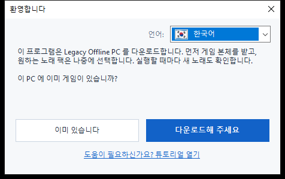
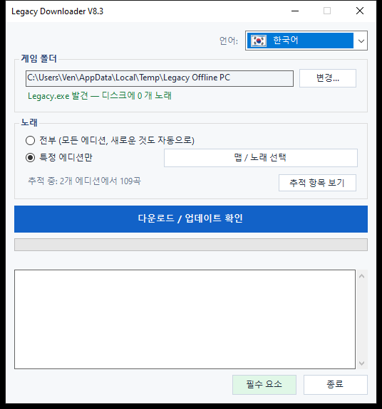
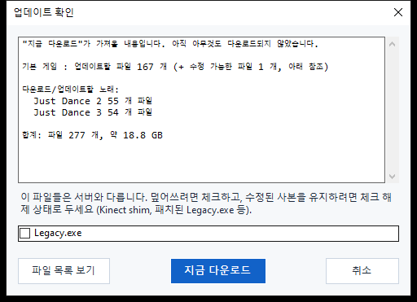

# Legacy Downloader — 튜토리얼

Legacy Downloader는 **Legacy Offline PC**와 노래 팩을 컴퓨터에 받아오고 최신
상태로 유지해 주는 프로그램입니다. 기술적인 지식은 전혀 필요 없습니다 — 아래
이미지를 순서대로 따라 하기만 하면 됩니다.

다른 언어: [English](en.md) · [Français](fr.md) · [Español](es.md) ·
[Deutsch](de.md) · [Italiano](it.md) · [Português](pt.md) · [Nederlands](nl.md) ·
[日本語](ja.md) · [简体中文](zh-Hans.md) · [繁體中文](zh-Hant.md) · [Русский](ru.md)

---

## 빠른 시작

짧은 버전만 원하는 분들을 위해:

1. [릴리스 페이지](https://github.com/VenB304/LegacyDownloader/releases)에서 zip을 다운로드하고 압축을 풉니다.
2. `LegacyDownloader.bat`를 더블클릭합니다.
3. 환영 화면의 안내를 따라가며 노래를 선택하고 **"다운로드 / 업데이트
   확인"**을 클릭합니다.
4. "준비가 완료되었습니다!"라는 메시지가 뜨면 게임 폴더의 `Legacy.exe`를
   열어 플레이하세요.

뭔가 헷갈리거나 설명과 다른 화면이 나온다면, 아래의 상세 안내에 각 화면에
대한 그림이 있습니다.

---

## 1. 다운로드하고 압축 풀기

1. [릴리스 페이지](https://github.com/VenB304/LegacyDownloader/releases)에서 최신 `LegacyDownloaderVX.zip`을
   받습니다.
2. 압축을 풉니다 — zip 파일을 마우스 오른쪽 버튼으로 클릭 → **압축 풀기...**
   → 일반 폴더를 선택합니다(바탕화면도 괜찮습니다). zip 창 안에서 직접
   실행하지 마세요.
3. 압축을 푼 폴더를 열고 **`LegacyDownloader.bat`**를 더블클릭합니다.


> 백신 프로그램이 `rclone.exe`(이 폴더 안의 파일)를 탐지한다면, 아래
> [문제 해결](#문제-해결) 섹션을 참고하세요 — 다운로드 자체의 문제가 아니라
> 잘 알려진 오탐입니다.

## 2. 첫 실행 — 환영 화면

다음으로 **"환영합니다"** 창이 나타납니다.



- **다른 언어가 표시되나요?** 모서리의 국기 드롭다운을 클릭해서 원하는
  언어를 선택하세요 — 프로그램 전체가 즉시 전환됩니다.
- 그런 다음 표시되는 하나의 질문에 답합니다.
  - **"이미 있습니다"** — Legacy Offline PC가 이미 이 PC 어딘가에 있다면
    선택하세요.
  - **"다운로드해 주세요"** — 아직 게임이 없다면 선택하세요. 이후는 모두
    자동으로 진행됩니다.

### 이미 게임이 있는 경우
폴더 선택 창이 열립니다. **`Legacy.exe`**가 바로 안에 들어 있는 폴더를
찾아 클릭한 다음(하위 폴더가 아니라), **폴더 선택**을 클릭합니다.

### 아직 게임이 없는 경우
게임이 위치할 폴더를 고를 수 있도록 폴더 선택 창이 열립니다 — 빈 폴더거나,
그 자리에서 새로 만든 폴더입니다(해당 창에 "새 폴더" 버튼이 있습니다).
**폴더 선택**을 클릭하면 게임 다운로드가 바로 시작됩니다 — 추가로 눌러야
할 버튼은 없습니다.

이 첫 다운로드는 용량이 큽니다 — 약 **1.2GB**로, 인터넷 속도에 따라 보통
5~20분 정도 걸립니다. 완료될 때까지 **창을 열어 두세요** — 창 안에서
진행 상황이 움직이는 것을 볼 수 있습니다.

> 노래는 이 첫 다운로드에 포함되지 않습니다 — 이건 게임 본체만 받는
> 단계이므로, 아직 노래가 나타나지 않아도 걱정하지 마세요.

## 3. 메인 창

게임 본체가 준비되면 여기로 이동합니다.



- **게임 폴더** — 게임이 있는 위치입니다. 나중에 게임을 옮기게 되면
  **변경...**으로 다른 곳을 지정할 수 있습니다.
- **노래** — 선택하세요:
  - **전부** — 사용 가능한 모든 Just Dance 에디션을 받고, 나중에 추가되는
    것도 자동으로 받습니다. 잘 모르겠다면 가장 간단한 선택지이니 이것을
    고르세요.
  - **특정 에디션만** — 정말 원하는 게임만(예: *Just Dance 2019*만) 체크
    하고 싶다면 **"에디션 선택..."**을 클릭하세요.
- **"다운로드 / 업데이트 확인"** — 큰 버튼입니다. 클릭하면 선택한 것을
  받아오고, 나중에 다시 클릭하면 새 노래나 업데이트를 확인할 수 있습니다.

## 4. 업데이트 확인하기

큰 버튼을 클릭한다고 바로 다운로드가 시작되지는 않습니다 — 먼저 무엇이
빠졌는지, 무엇이 바뀌었는지 **확인**합니다. 확인하는 동안 진행 표시줄이
퍼센트 표시 없이 왔다 갔다 할 수 있습니다 — 이는 정상이며, 멈춘 것이
아니라 서버와 파일을 비교하고 있다는 뜻입니다.



확인이 끝나면 발견된 내용과 전체 용량이 담긴 창이 나타납니다. 실제로
파일을 받으려면 **"지금 다운로드"**를, 무엇이 있는지만 보고 싶었다면
**"취소"**를 클릭하세요. 지난번 이후로 변경된 것이 없다면 그냥
**"모두 이미 최신 상태입니다"**라고 표시되고 끝납니다 — 클릭할 것이
없습니다.

<details>
<summary>게임 파일을 수정한 경우(Kinect 모드, 패치된 exe 등) — 클릭하여 펼치기</summary>

직접 수정한 파일(`Legacy.exe`나 Kinect DLL)이 서버 버전과 다르면, 자동으로
포함되지 않고 별도의 체크박스로 표시됩니다:
- **체크됨** = 서버의 사본으로 교체(아무것도 모드하지 않았다면 이것을
  선택하세요 — 그냥 일반적인 게임 업데이트입니다).
- **체크 안 됨** = 자신의 사본을 그대로 유지.

게임 내 설정(해상도, 창모드/전체화면)은 모드 여부와 관계없이 업데이트로
인해 절대 변경되지 않습니다.
</details>

## 5. 다운로드하는 동안

진행 표시줄과 아래의 로그창은 실시간으로 갱신됩니다 — 게임 본체와 각
노래 팩이 완료될 때마다 하나씩 표시됩니다. **실행 중에는 창을 닫지
마세요.** 모두 끝나면 다음과 같이 표시됩니다:

> **준비가 완료되었습니다! 게임 폴더의 Legacy.exe를 열어 플레이하세요.**

이것이 성공했다는 확인 표시입니다 — 가서 게임을 실행하세요.

## 6. 나중에 새 노래 확인하러 오기

언제든지 `LegacyDownloader.bat`를 다시 실행하기만 하면 됩니다. 폴더와 노래
선택 내용을 기억하고 있으며, **"다운로드 / 업데이트 확인"**을 클릭하면
마지막 방문 이후 새로 나온 것을 모두 받아옵니다.

- **노래 추가/제거**: **"에디션 선택..."**을 다시 사용하세요. 이미
  다운로드한 게임의 체크를 해제하면 해당 파일도 삭제할지, 아니면 갖고
  있는 것은 유지하되 업데이트만 중단할지 물어봅니다.
- **언어 변경**: 오른쪽 위의 국기 드롭다운을 언제든지 사용하세요.

---

## 텍스트/콘솔 버전 (고급 — 대부분은 필요하지 않습니다)

문제 해결용이나 취향에 따라 텍스트 메뉴 버전도 있습니다: 대신
**`LegacyDownloader-Console.bat`**를 더블클릭하세요. 기능은 동일하며,
숫자 키로 이동합니다:

```
[1] 다운로드 / 새 노래 확인
[2] 받을 노래 선택
[3] 게임 폴더 변경
[4] 언어
[5] 종료
```

> **글꼴 참고:** 그래픽 버전은 모든 언어를 올바르게 표시합니다. 이 텍스트
> 버전은 올바른 글자가 포함된 글꼴이 필요합니다 — 일본어, 한국어, 중국어,
> 러시아어는 여기서 네모(□)로 표시될 수 있습니다. 이러한 언어를 원한다면
> 그래픽 버전을 사용하세요.

---

## 문제 해결

- **백신 프로그램이 `rclone.exe`를 격리하거나 삭제함** — 잘 알려진
  오탐입니다. 일부 백신 프로그램은 공격자도 사용할 수 있다는 이유로
  `rclone`을 "해킹 도구"로 표시하지만, 이는 널리 사용되는 정당한
  오픈소스 도구이며, 이 프로그램이 파일을 받아오는 데 사용하는 유일한
  수단입니다. 백신의 격리/기록에서 복원하고 허용한 다음
  `LegacyDownloader.bat`를 다시 실행하세요.
- **`LegacyDownloader.bat`를 더블클릭하면 보안 경고가 나타남** — 다운로드한
  스크립트를 처음 실행할 때 발생할 수 있습니다. 그냥 진행하세요("추가 정보
  → 실행" 또는 비슷한 문구) — 작은 독립 도구에서는 정상적인 현상이며,
  문제가 있다는 신호가 아닙니다.
- **"rclone.exe가 없습니다" 메시지** — zip을 다시 다운로드하고 다시 압축을
  풀어 보세요. zip 뷰어 안에서 도구를 실행하지 마세요.
- **폴더 버튼을 클릭해도 아무 일도 일어나지 않음** — 선택 창이 메인 창
  *뒤에* 열렸을 수 있습니다. 작업 표시줄을 확인하세요.
- **"최신 상태"라고 나오는데 노래가 부족함** — **"에디션 선택..."**을 열어
  원하는 것이 정말 선택되어 있는지 확인하세요(또는 **"전부"**를 선택
  하세요).
- **그래도 해결되지 않나요?** Discord의 Legacy Downloader 스레드에 보이는
  화면과 어느 단계인지 스크린샷과 함께 올려 주세요 — 누군가 도와드릴
  것입니다.
