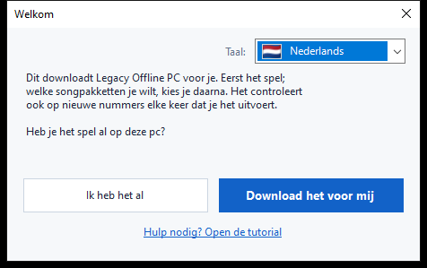
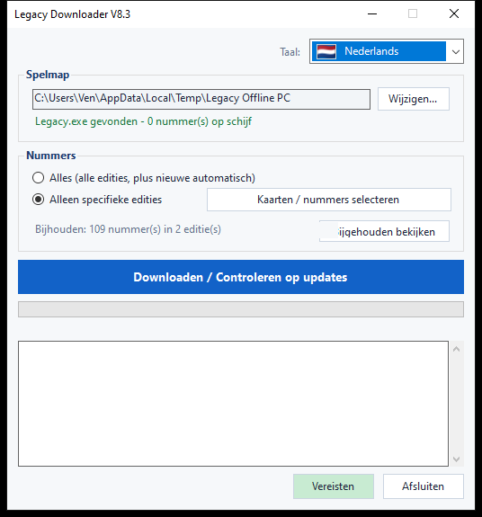
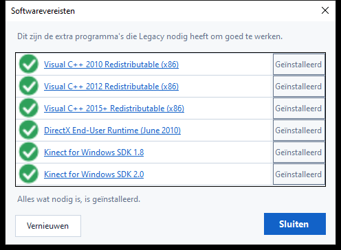
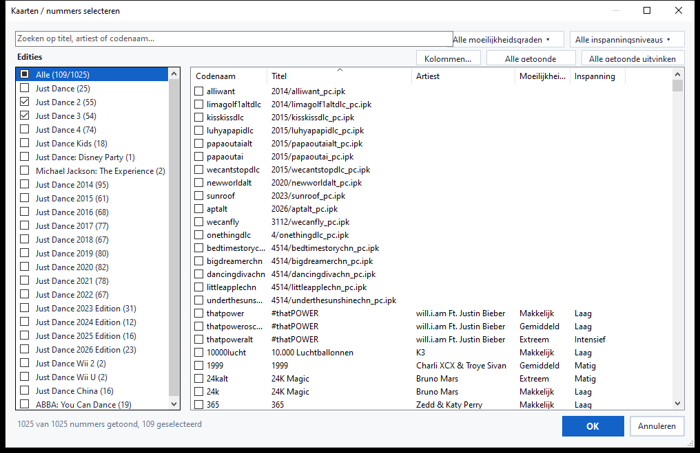
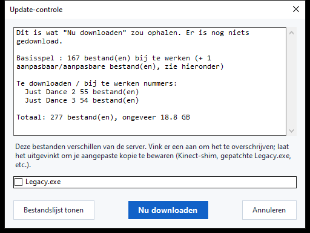

# Legacy Downloader — Handleiding

Legacy Downloader haalt **Legacy Offline PC** en de songpakketten naar je
computer en houdt ze up-to-date. Je hebt geen technische kennis nodig om
het te gebruiken — volg gewoon de afbeeldingen hieronder, in volgorde.

Andere talen: [English](en.md) · [Français](fr.md) · [Español](es.md) · [Filipino](fil.md) ·
[Deutsch](de.md) · [Italiano](it.md) · [Português](pt.md) · [日本語](ja.md) ·
[한국어](ko.md) · [简体中文](zh-Hans.md) · [繁體中文](zh-Hant.md) · [Русский](ru.md)

---

## Snelstart

Voor wie gewoon de korte versie wil:

1. Download de zip van de [Releases-pagina](https://github.com/VenB304/LegacyDownloader/releases) en pak hem
   uit.
2. Dubbelklik op `LegacyDownloader-GUI.bat`.
3. Volg de stappen van het welkomstscherm, kies je nummers en klik op
   **"Downloaden / Controleren op updates"**.
4. Als er "Je bent klaar!" verschijnt, open dan `Legacy.exe` in je spelmap
   om te spelen.

Als iets verwarrend lijkt of niet overeenkomt met wat hier staat, heeft de
uitgebreide handleiding hieronder een afbeelding voor elk scherm.

---

## 1. Downloaden en uitpakken

1. Haal de nieuwste `LegacyDownloaderVX.zip` op van de [Releases-pagina](https://github.com/VenB304/LegacyDownloader/releases).
2. Pak hem uit — rechtsklik op de zip → **Alles uitpakken...** → kies een
   normale map (het Bureaublad is prima). Voer het niet uit vanuit het
   zip-venster zelf.
3. Open de uitgepakte map en dubbelklik op
   **`LegacyDownloader-GUI.bat`**.


> Als je antivirus `rclone.exe` (een bestand in de map `bin`) markeert, kijk
> dan bij het gedeelte [Probleemoplossing](#probleemoplossing) hieronder —
> dat is een bekend fout-positief, geen echt probleem met de download.

## 2. Eerste keer opstarten — welkomstscherm

Daarna verschijnt een **"Welkom"**-venster.



- **Verkeerde taal te zien?** Klik op de vlag-vervolgkeuzelijst in de hoek
  en kies de jouwe — het hele programma schakelt meteen om.
- Beantwoord dan de ene gestelde vraag:
  - **"Ik heb het al"** — kies dit als Legacy Offline PC al ergens op deze
    pc staat.
  - **"Download het voor mij"** — kies dit als je het spel nog niet hebt.
    Alles hierna gaat automatisch.

### Als je het spel al hebt
Er opent een mapvenster. Zoek en klik de map aan die **`Legacy.exe`**
rechtstreeks bevat (niet in een submap), en klik dan op **Map
selecteren**.

### Als je het spel nog niet hebt
Er opent een mapvenster zodat je kunt kiezen waar het spel moet komen te
staan — een lege map, of een nieuwe die je daar meteen aanmaakt (er is een
"Nieuwe map"-knop in dat venster). Klik op **Map selecteren**, en het
downloaden van het spel begint meteen — geen extra knop nodig.

Deze eerste download is groot — ongeveer **1,2 GB**, meestal tussen de 5
en 20 minuten afhankelijk van je internet. **Laat het venster open** tot
het klaar is; je ziet de voortgang bewegen in het venster.

> Nummers maken geen deel uit van deze eerste download — dit is alleen het
> basisspel zelf, dus maak je geen zorgen als er nog geen nummers
> verschijnen.

## 3. Het hoofdvenster

Zodra het basisspel op zijn plek staat, kom je hier terecht:



- **Spelmap** — waar je spel staat. Met **Wijzigen...** kun je ergens
  anders naartoe wijzen als je het spel ooit verplaatst.
- **Nummers** — kies:
  - **Alles** — elke beschikbare Just Dance-editie, en nieuwe worden later
    automatisch opgehaald. Dit is de eenvoudigste optie als je het niet
    zeker weet — kies deze.
  - **Specifiek** — kies in plaats daarvan precies wat je wilt. Klik op
    **"Kaarten / nummers selecteren"** om de kiezer te openen — meer
    daarover in de volgende stap.
- **"Downloaden / Controleren op updates"** — de grote knop. Klik erop om
  op te halen wat je hebt gekozen, en klik er later opnieuw op om te
  controleren op nieuwe nummers of updates.

- **Vereisten** — controleert of de extra software die Legacy nodig heeft (Kinect SDK's, Visual C++ runtimes) is geïnstalleerd, en laat je ontbrekende software installeren.



## 4. Losse nummers kiezen

Klik op **"Kaarten / nummers selecteren"** (op elk moment, vanuit het
hoofdvenster) om de kiezer te openen:



- **Edities**, links — vink het vakje van een hele editie aan om alles
  daaruit te downloaden. Een half gevuld vakje betekent dat er maar een
  paar nummers van die editie zijn aangevinkt.
- **Nummers**, rechts — elk los nummer, met editie, moeilijkheidsgraad en
  inspanning (trainingsintensiteit) waar bekend. Vink elk nummer los aan
  of uit — je hoeft niet meteen een hele editie te nemen.
- **Zoeken** — typ een titel, artiest of codenaam om de lijst meteen te
  filteren.
- **Filters** — beperk de lijst verder op Moeilijkheidsgraad of Inspanning
  met de dropdowns rechtsboven.
- **Alle getoonde aanvinken / Alle getoonde uitvinken** — selecteer in één
  keer alles wat je huidige zoekopdracht of filter laat zien, in plaats
  van nummer voor nummer te klikken.
- **Kolommen...** — toon of verberg de kolommen Artiest, Moeilijkheidsgraad
  of Inspanning voor een eenvoudigere weergave.

Klik op **OK** om je keuzes op te slaan, of op **Annuleren** om terug te
gaan zonder iets te wijzigen.

> Nummers waar de communitylijst nog geen naam voor heeft, verschijnen
> gewoon toch (alleen met hun bestandsnaam in plaats van een titel) — ze
> worden gewoon gedownload en werken prima, alleen zonder leuke naam
> totdat iemand er een toevoegt.

## 5. Controleren op updates

Op de grote knop klikken downloadt niet meteen iets — het **controleert**
eerst wat er ontbreekt of veranderd is. Tijdens het controleren kan de
voortgangsbalk gewoon heen en weer schuiven zonder percentage — dat is
normaal, het betekent dat het nog steeds je bestanden vergelijkt met de
server, niet dat het vastzit.



Zodra het controleren klaar is, geeft een venster weer wat er is
gevonden, met een totale grootte. Klik op **"Nu downloaden"** om de
bestanden echt op te halen, of op **"Annuleren"** als je alleen wilde zien
wat er beschikbaar is. Als er sinds de vorige keer niets is veranderd,
staat er gewoon **"Alles is al up-to-date"** en stopt het daar — niets om
op te klikken.

<details>
<summary>Als je je spelbestanden hebt aangepast (Kinect-mod, gepatchte exe) — klik om uit te klappen</summary>

Als een bestand dat je persoonlijk hebt aangepast (`Legacy.exe` of een
Kinect-DLL) verschilt van de serverversie, krijgt het een eigen vinkje in
plaats van automatisch te worden meegenomen:
- **Aangevinkt** = vervangen door de kopie van de server (kies dit als je
  niets hebt gemod — het is gewoon een normale spelupdate).
- **Niet aangevinkt** = je eigen kopie ongewijzigd laten.

Je spelinstellingen (resolutie, venster-/volledig scherm) worden nooit
aangeraakt door een update, gemod of niet.
</details>

## 6. Tijdens het downloaden

De voortgangsbalk en het logvak eronder werken live bij — je ziet het
spel en elk songpakket vermeld zodra ze klaar zijn, één voor één.
**Sluit het venster niet terwijl dit bezig is.** Als alles klaar is, zie
je:

> **Je bent klaar! Open Legacy.exe in je spelmap om te spelen.**

Dat is je bevestiging dat het gelukt is — ga het spel starten.

## 7. Later terugkomen voor nieuwe nummers

Voer `LegacyDownloader-GUI.bat` gewoon op elk moment opnieuw uit. Het onthoudt
je map en je nummerkeuzes, en klikken op **"Downloaden / Controleren op
updates"** haalt alles op wat nieuw is sinds je laatste bezoek.

- **Nummers toevoegen of verwijderen**: klik opnieuw op **"Kaarten /
  nummers selecteren"**, vink aan of uit wat je wilt, en klik op OK. Het
  uitvinken van iets dat je al hebt gedownload — een hele editie of maar
  een paar nummers — vraagt of je ook die bestanden wilt verwijderen, of
  gewoon wilt stoppen met updates ervoor terwijl je behoudt wat je al
  hebt.
- **Taal wijzigen**: de vlag-vervolgkeuzelijst, rechtsboven, op elk
  moment.

---

## Tekst-/consoleversie (geavanceerd — de meeste mensen hebben dit niet nodig)

Er is ook een versie met tekstmenu, voor probleemoplossing of als je die
liever hebt: dubbelklik in plaats daarvan op
**`LegacyDownloader-Console.bat`**. Dezelfde functies, navigeren met
cijfertoetsen:

```
[1] Downloaden / op nieuwe nummers controleren
[2] Kiezen welke nummers je wilt
[3] Spelmap wijzigen
[4] Taal
[5] Softwarevereisten controleren
[6] Afsluiten
```

> **Opmerking over lettertype:** de grafische versie toont alle talen
> correct. Deze tekstversie heeft een lettertype nodig met de juiste
> tekens — Japans, Koreaans, Chinees en Russisch kunnen hier als
> vierkantjes (□) verschijnen. Als je een van die talen wilt, blijf dan
> bij de grafische versie.

---

## Probleemoplossing

- **Antivirus zet `rclone.exe` in quarantaine of verwijdert het** — een
  bekend fout-positief. Sommige antivirusprogramma's markeren `rclone`
  als een "hacktool" omdat aanvallers het ook kunnen gebruiken, maar het
  is een legitieme, veelgebruikte open-source tool, en het is het enige
  wat dit programma gebruikt om bestanden op te halen. Herstel het vanuit
  de quarantaine/geschiedenis van je antivirus, sta het toe, en voer
  `LegacyDownloader-GUI.bat` opnieuw uit.
- **Er verschijnt een beveiligingswaarschuwing als je dubbelklikt op
  `LegacyDownloader-GUI.bat`** — dit kan gebeuren de eerste keer dat je een
  gedownload script uitvoert. Klik erdoorheen ("Meer info → Toch
  uitvoeren", of iets vergelijkbaars) — dat is normaal voor een klein,
  onafhankelijk hulpmiddel, geen teken dat er iets mis is.
- **Melding "rclone.exe ontbreekt"** — download de zip opnieuw en pak hem
  opnieuw uit; voer het hulpmiddel niet uit vanuit de zip-viewer.
- **Er gebeurt niets als ik op een mapknop klik** — het keuzevenster is
  misschien *achter* het hoofdvenster geopend; controleer je taakbalk.
- **Er staat "up-to-date", maar ik mis nummers** — open **"Kaarten /
  nummers selecteren"** en controleer of je echt de gewenste hebt
  aangevinkt (of kies **"Alles"**).
- **Nog steeds vastzitten?** Plaats een bericht in de Legacy Downloader-
  topic op Discord met een screenshot van wat je ziet en bij welke stap je
  bent — iemand helpt je.
