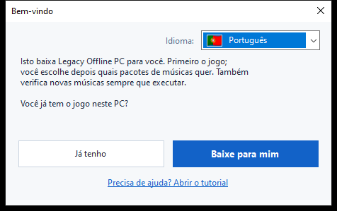
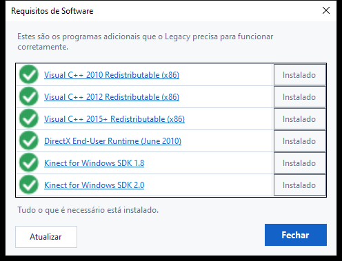
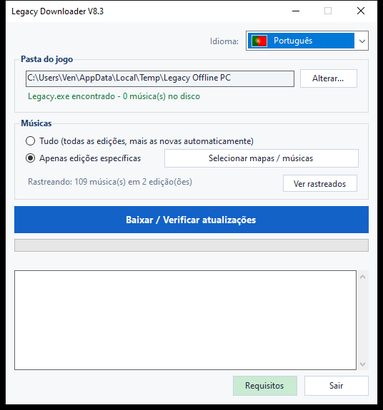
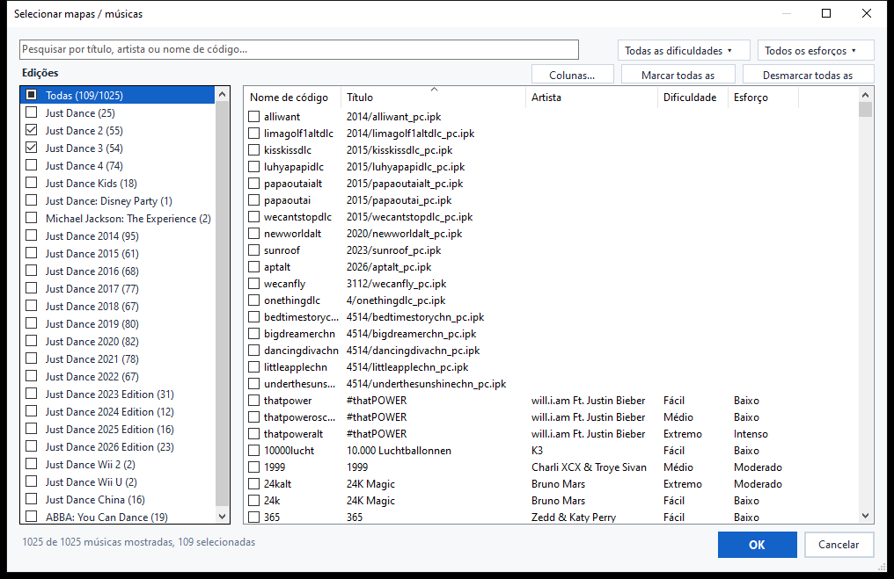
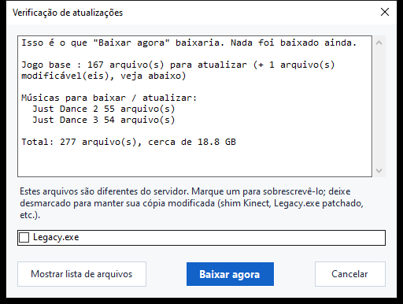

# Legacy Downloader — Tutorial

O Legacy Downloader baixa **Legacy Offline PC** e seus pacotes de músicas
para o seu computador e os mantém atualizados. Você não precisa de nenhum
conhecimento técnico para usá-lo — apenas siga as imagens abaixo, em ordem.

Outros idiomas: [English](en.md) · [Français](fr.md) · [Español](es.md) · [Filipino](fil.md) ·
[Deutsch](de.md) · [Italiano](it.md) · [Nederlands](nl.md) · [日本語](ja.md) ·
[한국어](ko.md) · [简体中文](zh-Hans.md) · [繁體中文](zh-Hant.md) · [Русский](ru.md)

---

## Início rápido

Para quem só quer a versão curta:

1. Baixe o zip da [página de Releases](https://github.com/VenB304/LegacyDownloader/releases) e extraia-o.
2. Dê duplo clique em `LegacyDownloader-GUI.bat`.
3. Siga os passos da tela de boas-vindas, escolha suas músicas e clique em
   **"Baixar / Verificar atualizações"**.
4. Quando aparecer "Você está atualizado!", abra `Legacy.exe` na sua pasta
   do jogo para jogar.

Se algo parecer confuso ou não corresponder ao descrito, o guia detalhado
abaixo tem uma imagem para cada tela.

---

## 1. Baixar e extrair

1. Pegue o `LegacyDownloaderVX.zip` mais recente na [página de Releases](https://github.com/VenB304/LegacyDownloader/releases).
2. Extraia-o — clique com o botão direito no zip → **Extrair tudo...** →
   escolha uma pasta normal (a Área de Trabalho serve). Não execute de
   dentro da janela do zip.
3. Abra a pasta extraída e dê duplo clique em
   **`LegacyDownloader-GUI.bat`**.


> Se o seu antivírus sinalizar `rclone.exe` (um arquivo dentro da
> pasta `bin`), veja a seção [Solução de problemas](#solução-de-problemas)
> abaixo — é um falso positivo conhecido, não um problema real com o
> download.

## 2. Primeira execução — tela de boas-vindas

Em seguida aparece uma janela de **"Bem-vindo"**.



- **Aparece o idioma errado?** Clique no menu suspenso da bandeira no
  canto e escolha o seu — o programa inteiro muda instantaneamente.
- Depois responda à única pergunta feita:
  - **"Já tenho"** — escolha isso se Legacy Offline PC já está em algum
    lugar neste PC.
  - **"Baixe para mim"** — escolha isso se ainda não tem o jogo. Tudo o
    que vem depois é automático.

### Se você já tem o jogo
Uma janela de seleção de pasta se abre. Encontre e clique na pasta que tem
**`Legacy.exe`** diretamente dentro dela (não em uma subpasta), depois
clique em **Selecionar pasta**.

### Se você ainda não tem o jogo
Uma janela de seleção de pasta se abre para você escolher onde o jogo vai
morar — uma pasta vazia, ou uma nova que você cria ali mesmo (há um botão
"Nova pasta" nessa janela). Clique em **Selecionar pasta**, e o download
do jogo começa imediatamente — nenhum botão extra para apertar.

Esse primeiro download é grande — cerca de **1,2 GB**, geralmente entre 5
e 20 minutos dependendo da sua internet. **Deixe a janela aberta** até
terminar; você verá o progresso avançando na janela.

> As músicas não fazem parte deste primeiro download — é apenas o jogo
> base em si, então não se preocupe se nenhuma música aparecer ainda.

## 3. Verificando os requisitos de software

O Legacy precisa de alguns programas extras que o Windows não traz por
padrão — Kinect SDKs e runtimes do Visual C++. O Legacy Downloader
verifica isso automaticamente, uma única vez:

- **Se você já tinha o jogo**, essa verificação acontece imediatamente,
  antes mesmo da janela principal aparecer.
- **Se você escolheu "Baixe para mim"**, ela acontece automaticamente
  assim que o download acima terminar.



Tudo o que aparecer em vermelho está faltando — clique em **Instalar** ao
lado para baixar e instalar, ou clique no nome com link para abrir a
página oficial de download da Microsoft em vez disso. Quando tudo estiver
verde, clique em **Fechar** para continuar. Você pode reabrir essa
verificação a qualquer momento pelo botão **Requisitos** na janela
principal.

## 4. A janela principal

Assim que o jogo base estiver pronto, você chega aqui:



- **Pasta do jogo** — onde seu jogo mora. **Alterar...** permite apontar
  para outro lugar caso você mova o jogo algum dia.
- **Músicas** — escolha:
  - **Tudo** — todas as edições de Just Dance disponíveis, e pegará as
    novas automaticamente conforme forem lançadas. Esta é a opção mais
    simples se você não tem certeza — escolha esta.
  - **Específicas** — escolha exatamente o que você quer, em vez disso.
    Clique em **"Selecionar mapas / músicas"** para abrir o seletor — veja
    o próximo passo.
- **"Baixar / Verificar atualizações"** — o botão grande. Clique para
  obter o que você escolheu, e clique novamente mais tarde para verificar
  novas músicas ou atualizações.
- **Requisitos** — reabre a verificação do passo anterior, sempre que você
  quiser reverificar ou instalar algo que tenha pulado.

## 5. Escolhendo músicas individuais

Clique em **"Selecionar mapas / músicas"** (a partir da janela principal, a
qualquer momento) para abrir o seletor:



- **Edições**, à esquerda — marque a caixa de uma edição inteira para
  pegar tudo dela. Uma caixa que parece meio preenchida significa que só
  algumas músicas daquela edição estão marcadas.
- **Músicas**, à direita — cada música individual, com sua edição,
  dificuldade e esforço (intensidade do exercício) quando conhecidos.
  Marque ou desmarque qualquer música sozinha — não precisa pegar uma
  edição inteira de uma vez.
- **Pesquisar** — digite um título, artista ou nome de código para filtrar
  a lista instantaneamente.
- **Filtros** — restrinja ainda mais a lista por Dificuldade ou Esforço
  usando os menus suspensos no canto superior direito.
- **Marcar todas as exibidas / Desmarcar todas as exibidas** — selecione
  em massa o que sua pesquisa ou filtro atual estiver mostrando, em vez de
  clicar música por música.
- **Colunas...** — mostre ou oculte as colunas Artista, Dificuldade ou
  Esforço se preferir uma visão mais simples.

Clique em **OK** para salvar suas escolhas, ou em **Cancelar** para voltar
sem mudar nada.

> Músicas que a lista da comunidade ainda não tem um nome aparecem mesmo
> assim (só com o nome do arquivo em vez de um título) — elas serão
> baixadas e funcionarão normalmente, só sem um nome amigável até alguém
> adicionar um.

## 6. Verificando atualizações

Clicar no botão grande não baixa nada imediatamente — primeiro ele
**verifica** o que está faltando ou mudou. Enquanto verifica, a barra de
progresso pode simplesmente deslizar para frente e para trás sem
porcentagem — isso é normal, significa que ainda está comparando seus
arquivos com o servidor, não que travou.



Assim que terminar de verificar, uma janela lista o que foi encontrado,
com um tamanho total. Clique em **"Baixar agora"** para realmente obter os
arquivos, ou em **"Cancelar"** se só queria ver o que está disponível. Se
nada mudou desde a última vez, ela apenas diz **"Tudo já está
atualizado"** e para por aí — nada para clicar.

<details>
<summary>Se você modificou seus arquivos de jogo (mod de Kinect, exe corrigido) — clique para expandir</summary>

Se um arquivo que você modificou pessoalmente (`Legacy.exe` ou uma DLL de
Kinect) for diferente da versão do servidor, ele recebe sua própria caixa
de seleção em vez de ser incluído automaticamente:
- **Marcada** = substituir pela cópia do servidor (escolha isso se você
  não modificou nada — é apenas uma atualização normal do jogo).
- **Desmarcada** = manter sua própria cópia como está.

Suas configurações no jogo (resolução, janela/tela cheia) nunca são
tocadas por uma atualização, modificada ou não.
</details>

## 7. Durante o download

A barra de progresso e a caixa de registro abaixo dela se atualizam ao
vivo — você verá o jogo e cada pacote de músicas listados conforme
terminam, um por um. **Não feche a janela enquanto isso estiver
rodando.** Quando tudo estiver pronto, você verá:

> **Você está atualizado! Abra Legacy.exe na sua pasta do jogo para
> jogar.**

Essa é sua confirmação de que funcionou — vá iniciar o jogo.

## 8. Voltando depois por novas músicas

Basta executar `LegacyDownloader-GUI.bat` novamente a qualquer momento. Ele
lembra sua pasta e suas escolhas de músicas, e clicar em **"Baixar /
Verificar atualizações"** pega tudo que é novo desde sua última visita.

- **Adicionar ou remover músicas**: clique em **"Selecionar mapas /
  músicas"** novamente, marque ou desmarque o que quiser, e clique em OK.
  Desmarcar algo já baixado — uma edição inteira ou só algumas músicas —
  vai perguntar se quer também excluir esses arquivos, ou apenas parar de
  receber atualizações para eles mantendo o que você já tem.
- **Mudar idioma**: o menu suspenso da bandeira, no canto superior
  direito, a qualquer momento.

---

## Versão texto/console (avançado — a maioria não precisa disso)

Também existe uma versão de menu em texto, para solução de problemas ou
se você preferir: dê duplo clique em
**`LegacyDownloader-Console.bat`** em vez disso. Mesmas funcionalidades,
navegando com as teclas numéricas:

```
[1] Baixar / verificar novas músicas
[2] Escolher quais músicas baixar
[3] Alterar pasta do jogo
[4] Idioma
[5] Verificar requisitos de software
[6] Sair
```

> **Nota sobre a fonte:** a versão gráfica exibe todos os idiomas
> corretamente. Esta versão em texto precisa de uma fonte com os
> caracteres certos — japonês, coreano, chinês e russo podem aparecer
> como quadrados (□) aqui. Se você quiser um desses idiomas, fique com a
> versão gráfica.

---

## Solução de problemas

- **O antivírus coloca `rclone.exe` em quarentena ou o exclui** — um
  falso positivo conhecido. Alguns antivírus sinalizam o `rclone` como uma
  "ferramenta de hacking" porque atacantes também podem usá-lo, mas é uma
  ferramenta de código aberto legítima e amplamente usada, e é a única
  coisa que este programa usa para buscar arquivos. Restaure-o da
  quarentena/histórico do seu antivírus, permita-o, depois execute
  `LegacyDownloader-GUI.bat` novamente.
- **Um aviso de segurança aparece ao dar duplo clique em
  `LegacyDownloader-GUI.bat`** — isso pode acontecer na primeira vez que você
  executa qualquer script baixado. Clique para continuar ("Mais
  informações → Executar assim mesmo", ou algo parecido) — isso é normal
  para uma ferramenta pequena e independente, não um sinal de que algo
  está errado.
- **Mensagem "rclone.exe está faltando"** — baixe o zip novamente e
  extraia de novo; não execute a ferramenta de dentro do visualizador de
  zip.
- **Nada acontece quando clico em um botão de pasta** — a janela de
  seleção pode ter aberto *atrás* da janela principal; verifique sua
  barra de tarefas.
- **Diz "atualizado" mas estou sem músicas** — abra **"Selecionar mapas /
  músicas"** e verifique se você realmente marcou as que quer (ou escolha
  **"Tudo"**).
- **Ainda travado?** Poste no tópico do Legacy Downloader no Discord com
  uma captura de tela do que você está vendo e em qual passo você está —
  alguém vai ajudar.
