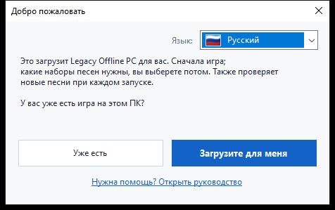
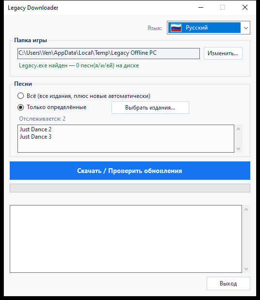
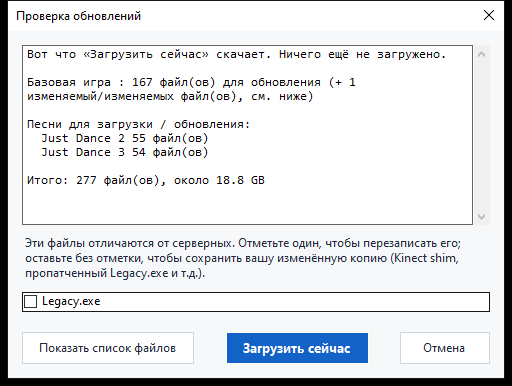

# Legacy Downloader — Инструкция

Legacy Downloader загружает **Legacy Offline PC** и наборы песен на ваш
компьютер и поддерживает их в актуальном состоянии. Никаких технических
знаний не требуется — просто следуйте картинкам ниже по порядку.

Другие языки: [English](en.md) · [Français](fr.md) · [Español](es.md) ·
[Deutsch](de.md) · [Italiano](it.md) · [Português](pt.md) · [Nederlands](nl.md) ·
[日本語](ja.md) · [한국어](ko.md) · [简体中文](zh-Hans.md) · [繁體中文](zh-Hant.md)

---

## Быстрый старт

Для тех, кому нужна только краткая версия:

1. Скачайте zip со [страницы Releases](../../releases) и распакуйте его.
2. Дважды кликните по `LegacyDownloader.bat`.
3. Пройдите шаги приветственного окна, выберите песни и нажмите
   **«Скачать / Проверить обновления»**.
4. Когда появится «Всё готово!», откройте `Legacy.exe` в папке игры и
   играйте.

Если что-то кажется непонятным или не совпадает с описанием, в подробной
инструкции ниже для каждого экрана есть картинка.

---

## 1. Скачивание и распаковка

1. Возьмите последний `LegacyDownloaderVX.zip` со [страницы Releases](../../releases).
2. Распакуйте его — правый клик по zip → **Извлечь всё...** → выберите
   обычную папку (подойдёт и Рабочий стол). Не запускайте его прямо из
   окна zip-архива.
3. Откройте распакованную папку и дважды кликните по
   **`LegacyDownloader.bat`**.


> Если ваш антивирус отмечает `rclone.exe` (файл в этой папке), смотрите
> раздел [Устранение неполадок](#устранение-неполадок) ниже — это
> известное ложное срабатывание, а не реальная проблема с загрузкой.

## 2. Первый запуск — окно приветствия

Далее появится окно **«Добро пожаловать»**.



- **Показан не тот язык?** Нажмите на выпадающий список с флагом в углу и
  выберите свой — вся программа переключится мгновенно.
- Затем ответьте на единственный заданный вопрос:
  - **«Уже есть»** — выберите это, если Legacy Offline PC уже где-то есть
    на этом ПК.
  - **«Загрузите для меня»** — выберите это, если игры у вас ещё нет.
    Всё остальное произойдёт автоматически.

### Если игра у вас уже есть
Откроется окно выбора папки. Найдите и кликните папку, в которой
**`Legacy.exe`** находится напрямую (не в подпапке), затем нажмите
**Выбор папки**.

### Если игры у вас ещё нет
Откроется окно выбора папки, чтобы вы могли выбрать, где будет жить
игра — пустая папка или новая, которую вы создадите прямо там (в этом
окне есть кнопка «Новая папка»). Нажмите **Выбор папки**, и загрузка
игры начнётся сразу — никакой дополнительной кнопки нажимать не нужно.

Эта первая загрузка большая — около **1,2 ГБ**, обычно от 5 до 20 минут
в зависимости от вашего интернета. **Не закрывайте окно**, пока загрузка
не завершится; прогресс будет виден прямо в окне.

> Песни не входят в эту первую загрузку — это только сама базовая игра,
> так что не переживайте, если песни пока не появились.

## 3. Главное окно

Как только базовая игра готова, вы попадаете сюда:



- **Папка игры** — где находится ваша игра. **Изменить...** позволяет
  указать другое место, если вы когда-нибудь перенесёте игру.
- **Песни** — выберите:
  - **Всё** — каждое доступное издание Just Dance, а новые будут
    добавляться автоматически позже. Это самый простой вариант, если вы
    не уверены — выберите его.
  - **Только определённые издания** — нажмите **«Выбрать издания...»**,
    чтобы отметить только те игры, которые вам действительно нужны
    (например, только *Just Dance 2019*), если вы не хотите скачивать
    всё подряд.
- **«Скачать / Проверить обновления»** — большая кнопка. Нажмите, чтобы
  получить то, что вы выбрали, а позже нажимайте снова, чтобы проверить
  новые песни или обновления.

## 4. Проверка обновлений

Нажатие на большую кнопку не запускает загрузку сразу — сначала она
**проверяет**, чего не хватает или что изменилось. Во время проверки
индикатор выполнения может просто двигаться туда-сюда без процентов —
это нормально, значит она всё ещё сравнивает ваши файлы с сервером, а
не зависла.



Когда проверка завершится, окно покажет список найденного и общий
размер. Нажмите **«Загрузить сейчас»**, чтобы действительно скачать
файлы, или **«Отмена»**, если вы просто хотели посмотреть, что доступно.
Если с прошлого раза ничего не изменилось, там просто будет написано
**«Всё уже актуально»**, и на этом всё — нажимать нечего.

<details>
<summary>Если вы изменяли файлы игры (мод Kinect, пропатченный exe) — нажмите, чтобы развернуть</summary>

Если файл, который вы лично изменили (`Legacy.exe` или DLL Kinect),
отличается от серверной версии, для него появится отдельный флажок
вместо автоматического включения:
- **Отмечено** = заменить серверной копией (выберите это, если вы ничего
  не модифицировали — это просто обычное обновление игры).
- **Не отмечено** = оставить вашу собственную копию как есть.

Ваши игровые настройки (разрешение, оконный/полноэкранный режим) никогда
не затрагиваются обновлением, независимо от модификаций.
</details>

## 5. Во время загрузки

Индикатор выполнения и окно журнала под ним обновляются в реальном
времени — вы увидите игру и каждый набор песен в списке по мере
завершения, один за другим. **Не закрывайте окно, пока это идёт.**
Когда всё будет готово, вы увидите:

> **Всё готово! Откройте Legacy.exe в папке игры, чтобы играть.**

Это подтверждение того, что всё сработало — идите запускать игру.

## 6. Возвращение позже за новыми песнями

Просто запустите `LegacyDownloader.bat` снова в любое время. Программа
помнит вашу папку и выбор песен, а нажатие **«Скачать / Проверить
обновления»** получает всё новое с момента вашего последнего визита.

- **Добавить или убрать песни**: снова используйте **«Выбрать
  издания...»**. Снятие отметки с уже загруженной игры спросит, удалить
  ли также эти файлы или просто прекратить получать для неё обновления,
  сохранив то, что у вас есть.
- **Смена языка**: выпадающий список с флагом в правом верхнем углу, в
  любой момент.

---

## Текстовая/консольная версия (для продвинутых — большинству не нужна)

Есть также версия с текстовым меню, для устранения неполадок или если вы
её предпочитаете: вместо этого дважды кликните по
**`LegacyDownloader-Console.bat`**. Те же функции, навигация цифровыми
клавишами:

```
[1] Загрузить / проверить наличие новых песен
[2] Выбрать, какие песни получать
[3] Изменить папку игры
[4] Язык
[5] Выход
```

> **Заметка о шрифте:** графическая версия отображает все языки
> корректно. Этой текстовой версии нужен шрифт с нужными символами —
> японский, корейский, китайский и русский могут отображаться здесь как
> квадратики (□). Если вам нужен один из этих языков, используйте
> графическую версию.

---

## Устранение неполадок

- **Антивирус помещает `rclone.exe` в карантин или удаляет его** —
  известное ложное срабатывание. Некоторые антивирусы помечают `rclone`
  как «хакерский инструмент», потому что злоумышленники тоже могут его
  использовать, но это легитимный, широко используемый инструмент с
  открытым кодом, и это единственное, что эта программа использует для
  получения файлов. Восстановите его из карантина/истории антивируса,
  разрешите, затем снова запустите `LegacyDownloader.bat`.
- **При двойном клике по `LegacyDownloader.bat` появляется
  предупреждение безопасности** — это может произойти при первом запуске
  любого скачанного скрипта. Пройдите через него («Подробнее → Всё равно
  запустить» или похожая формулировка) — это нормально для небольшого
  независимого инструмента, а не признак проблемы.
- **Сообщение «rclone.exe отсутствует»** — скачайте zip заново и снова
  распакуйте его; не запускайте программу прямо из окна просмотра zip.
- **Ничего не происходит при нажатии на кнопку папки** — окно выбора,
  возможно, открылось *позади* главного окна; проверьте панель задач.
- **Написано «актуально», но песен не хватает** — откройте **«Выбрать
  издания...»** и проверьте, что вы действительно выбрали нужные (или
  выберите **«Всё»**).
- **Всё ещё не получается?** Напишите в теме Legacy Downloader в Discord
  со скриншотом того, что вы видите, и на каком шаге застряли — кто-нибудь
  поможет.
