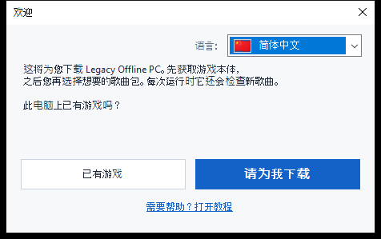
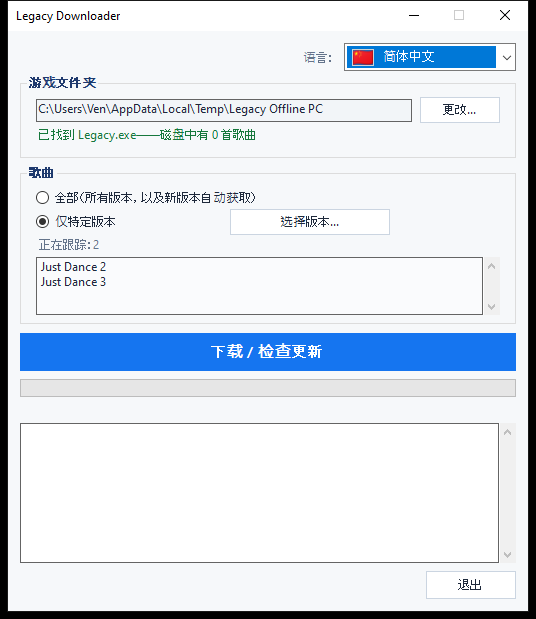
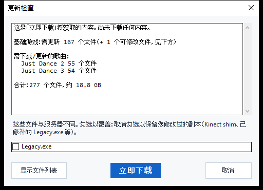

# Legacy Downloader — 教程

Legacy Downloader 会把 **Legacy Offline PC** 及其歌曲包下载到您的电脑上，并保持
更新。使用它不需要任何技术知识——只需按顺序跟着下面的图片操作即可。

其他语言：[English](en.md) · [Français](fr.md) · [Español](es.md) ·
[Deutsch](de.md) · [Italiano](it.md) · [Português](pt.md) · [Nederlands](nl.md) ·
[日本語](ja.md) · [한국어](ko.md) · [繁體中文](zh-Hant.md) · [Русский](ru.md)

---

## 快速开始

如果您只想看简短版本：

1. 从 [Releases 页面](../../releases) 下载 zip 并解压。
2. 双击 `LegacyDownloader.bat`。
3. 按照欢迎界面的步骤操作，选择您想要的歌曲，然后点击
   **"下载 / 检查更新"**。
4. 出现"一切就绪！"提示后，打开游戏文件夹中的 `Legacy.exe` 即可开始游玩。

如果哪一步看起来令人困惑，或者与描述的画面不一样，下面的详细步骤为每个
界面都配有图片。

---

## 1. 下载并解压

1. 从 [Releases 页面](../../releases) 获取最新的 `LegacyDownloaderVX.zip`。
2. 解压它——右键点击 zip 文件 → **全部解压...** → 选择一个普通文件夹（桌面
   即可）。不要直接在 zip 窗口内运行它。
3. 打开解压后的文件夹，双击 **`LegacyDownloader.bat`**。


> 如果您的杀毒软件报告 `rclone.exe`（此文件夹中的一个文件），请查看下面的
> [疑难解答](#疑难解答) 部分——这是已知的误报，并不是下载本身出了问题。

## 2. 首次运行——欢迎界面

接下来会出现一个**"欢迎"**窗口。



- **显示的语言不对？** 点击右上角的国旗下拉菜单，选择您的语言——整个程序
  会立即切换。
- 然后回答它提出的唯一一个问题：
  - **"已有游戏"** — 如果 Legacy Offline PC 已经在这台电脑上的某个位置，
    选择这个。
  - **"请为我下载"** — 如果您还没有这个游戏，选择这个。之后的一切都会
    自动完成。

### 如果您已经有这个游戏
会弹出一个文件夹选择窗口。找到并点击直接包含 **`Legacy.exe`** 的文件夹
（不是子文件夹），然后点击**选择文件夹**。

### 如果您还没有这个游戏
会弹出一个文件夹选择窗口，让您选择游戏要放在哪里——一个空文件夹，或者
您当场新建的文件夹（该窗口中有一个"新建文件夹"按钮）。点击**选择文件夹**
后，游戏下载会立即开始——无需再点击其他按钮。

这第一次下载的体积较大——大约 **1.2 GB**，根据您的网络情况，通常需要
5 到 20 分钟。请**保持窗口打开**直到完成；您会在窗口中看到进度在变化。

> 歌曲不包含在这第一次下载中——这次只下载游戏本体，所以如果还没看到
> 任何歌曲，不用担心。

## 3. 主窗口

游戏本体准备好后，您会看到这个界面：



- **游戏文件夹** — 您游戏所在的位置。如果以后移动了游戏，可以用
  **更改...** 指向新位置。
- **歌曲** — 选择：
  - **全部** — 获取所有可用的 Just Dance 版本，以后新出的也会自动获取。
    如果您不确定该选哪个，这是最简单的选项——选它就对了。
  - **仅特定版本** — 点击**"选择版本..."**，只勾选您真正想要的游戏
    （例如只要 *Just Dance 2019*），如果您不想下载全部内容的话。
- **"下载 / 检查更新"** — 那个大按钮。点击它来获取您选择的内容，之后随时
  再次点击即可检查新歌曲或更新。

## 4. 检查更新

点击大按钮并不会立即开始下载——它会先**检查**缺少或有变化的内容。检查
过程中，进度条可能只是来回滑动而不显示百分比——这是正常现象，说明它仍在
将您的文件与服务器进行比对，而不是卡住了。



检查完成后，会出现一个窗口列出找到的内容及总大小。点击**"立即下载"**
来真正获取这些文件，或者点击**"取消"**，如果您只是想看看有哪些可用内容。
如果自上次以来没有任何变化，它会直接显示**"所有内容均已是最新状态"**并
到此为止——没有需要点击的内容。

<details>
<summary>如果您修改过游戏文件（Kinect 模组、已修补的 exe 等）——点击展开</summary>

如果您个人修改过的文件（`Legacy.exe` 或某个 Kinect DLL）与服务器版本不同，
它会单独获得一个复选框，而不是被自动包含在内：
- **已勾选** = 用服务器的副本替换（如果您没有修改过任何内容，请选这个——
  这只是一次正常的游戏更新）。
- **未勾选** = 保留您自己的副本不变。

无论是否经过修改，您的游戏内设置（分辨率、窗口/全屏模式）都不会被更新
所触碰。
</details>

## 5. 下载过程中

进度条和下方的日志框会实时更新——您会看到游戏本体和每个歌曲包依次完成后
被列出来。**下载进行时请不要关闭窗口。** 全部完成后，您会看到：

> **一切就绪！打开游戏文件夹中的 Legacy.exe 即可开始游玩。**

这就是成功的确认信息——去启动游戏吧。

## 6. 以后回来获取新歌曲

随时重新运行 `LegacyDownloader.bat` 即可。它会记住您的文件夹和歌曲选择，
点击**"下载 / 检查更新"**就能获取自上次访问以来的所有新内容。

- **添加或移除歌曲**：再次使用**"选择版本..."**。取消勾选一个已下载的
  游戏时，会询问您是同时删除这些文件，还是只是停止更新但保留已有内容。
- **更改语言**：右上角的国旗下拉菜单，随时可用。

---

## 文本/控制台版本（进阶——大多数人不需要）

也有一个文本菜单版本，供排查问题或您偏好使用：改为双击
**`LegacyDownloader-Console.bat`**。功能相同，用数字键导航：

```
[1] 下载/检查新歌曲
[2] 选择要获取的歌曲
[3] 更改游戏文件夹
[4] 语言
[5] 退出
```

> **字体说明：** 图形版能正确显示所有语言。这个文本版本需要一个包含正确
> 字符的字体——日语、韩语、中文和俄语在这里可能会显示为方块（□）。如果
> 您需要这些语言，请使用图形版本。

---

## 疑难解答

- **杀毒软件隔离或删除了 `rclone.exe`** — 这是已知的误报。一些杀毒软件
  会将 `rclone` 标记为"黑客工具"，因为攻击者也可能使用它，但它实际上是
  一个合法且被广泛使用的开源工具，也是本程序获取文件所使用的唯一方式。
  请从杀毒软件的隔离区/历史记录中恢复它并允许，然后重新运行
  `LegacyDownloader.bat`。
- **双击 `LegacyDownloader.bat` 时出现安全警告** — 首次运行下载的脚本时
  可能会发生这种情况。点击继续（"更多信息 → 仍要运行"或类似的文字）——
  对于一个小型独立工具来说这是正常现象，并不代表出了问题。
- **"rclone.exe 缺失"提示** — 重新下载 zip 并再次解压；不要在 zip 查看器
  内直接运行该工具。
- **点击文件夹按钮没有反应** — 选择窗口可能打开在了主窗口*后面*；请查看
  您的任务栏。
- **显示"已是最新"但我缺少歌曲** — 打开**"选择版本..."**，检查您是否
  真的选择了想要的版本（或者选择**"全部"**）。
- **仍然卡住了？** 请在 Discord 的 Legacy Downloader 帖子中发布您看到的
  内容截图，并说明您卡在哪一步——会有人来帮助您。
