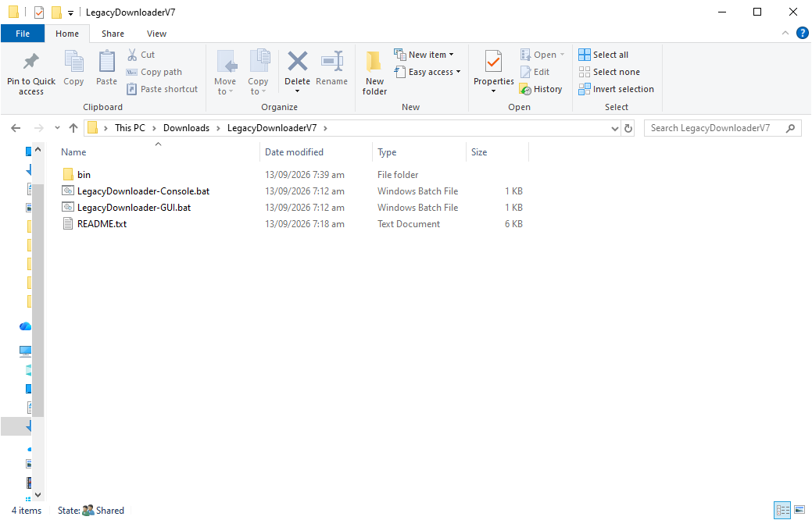
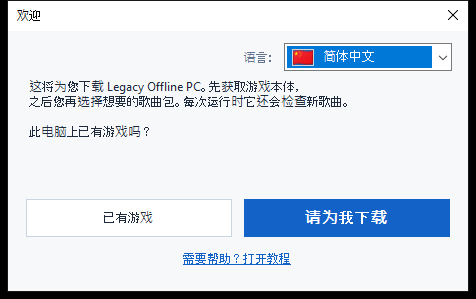
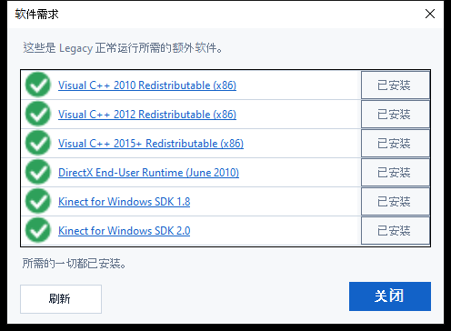
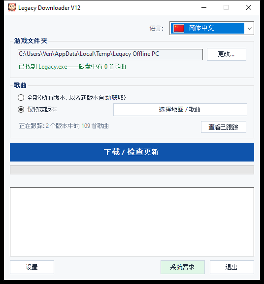
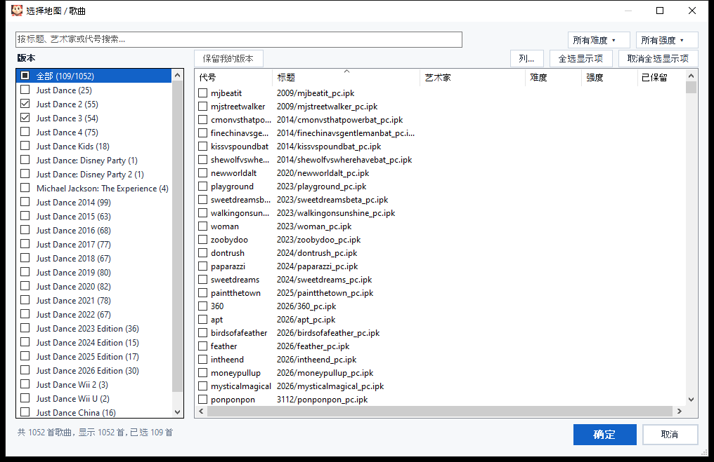
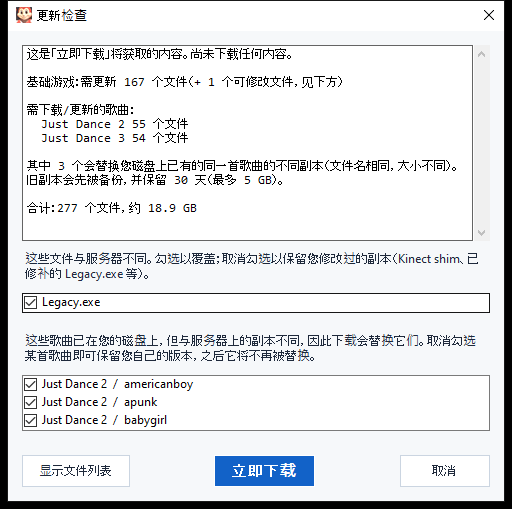
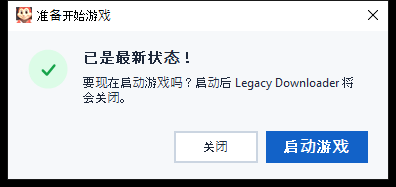
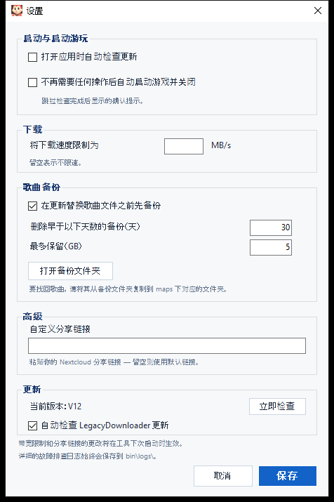
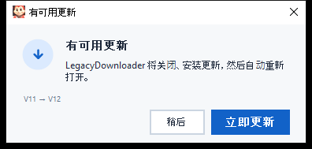

# Legacy Downloader — 教程

Legacy Downloader 会把 **Legacy Offline PC** 及其歌曲包下载到您的电脑上，并保持
更新。使用它不需要任何技术知识——只需按顺序跟着下面的图片操作即可。

其他语言：[English](en.md) · [Français](fr.md) · [Español](es.md) · [Filipino](fil.md) ·
[Deutsch](de.md) · [Italiano](it.md) · [Português](pt.md) · [Nederlands](nl.md) ·
[日本語](ja.md) · [한국어](ko.md) · [繁體中文](zh-Hant.md) · [Русский](ru.md)

---

## 快速开始

如果您只想看简短版本：

1. 从 [Releases 页面](https://github.com/VenB304/LegacyDownloader/releases) 下载 zip 并解压。
2. 双击 `LegacyDownloader-GUI.bat`。
3. 按照欢迎界面的步骤操作，选择您想要的歌曲，然后点击
   **"下载 / 检查更新"**。
4. 出现"一切就绪！"提示后，打开游戏文件夹中的 `Legacy.exe` 即可开始游玩。

如果哪一步看起来令人困惑，或者与描述的画面不一样，下面的详细步骤为每个
界面都配有图片。

---

## 1. 下载并解压

1. 从 [Releases 页面](https://github.com/VenB304/LegacyDownloader/releases) 获取最新的 `LegacyDownloaderVX.zip`。
2. 解压它——右键点击 zip 文件 → **全部解压...** → 选择一个普通文件夹（桌面
   即可）。不要直接在 zip 窗口内运行它。
3. 打开解压后的文件夹，双击 **`LegacyDownloader-GUI.bat`**。



> 如果您的杀毒软件报告 `rclone.exe`（`bin` 文件夹中的一个文件），请查看下面的
> [疑难解答](#疑难解答) 部分——这是已知的误报，并不是下载本身出了问题。

## 2. 首次运行——欢迎界面

接下来会出现一个**"欢迎"**窗口。



- **显示的语言不对？** 点击右上角的国旗下拉菜单，选择您的语言——整个程序
  会立即切换。
- 然后回答它提出的唯一一个问题：
  - **"已有游戏"** — 如果 Legacy Offline PC 已经在这台电脑上的某个位置，
    选择这个。
  - **"请为我下载"** — 如果您还没有这个游戏，选择这个。之后的一切都会
    自动完成。

### 如果您已经有这个游戏
会弹出一个文件夹选择窗口。找到并点击直接包含 **`Legacy.exe`** 的文件夹
（不是子文件夹），然后点击**选择文件夹**。

### 如果您还没有这个游戏
会弹出一个文件夹选择窗口，让您选择游戏要放在哪里——一个空文件夹，或者
您当场新建的文件夹（该窗口中有一个"新建文件夹"按钮）。点击**选择文件夹**
后，游戏下载会立即开始——无需再点击其他按钮。

这第一次下载的体积较大——大约 **1.2 GB**，根据您的网络情况，通常需要
5 到 20 分钟。请**保持窗口打开**直到完成；您会在窗口中看到进度在变化。

> 歌曲不包含在这第一次下载中——这次只下载游戏本体，所以如果还没看到
> 任何歌曲，不用担心。

## 3. 检查软件需求

Legacy 需要一些 Windows 没有内置的额外软件——Kinect SDK 和 Visual C++
运行库。Legacy Downloader 会自动检查一次：

- **如果您本来就已经有这个游戏**，这项检查会立即进行，甚至在主窗口出现
  之前。
- **如果您选择了"请为我下载"**，则会在上面的下载完成后自动进行。



标红的项目表示缺失——点击旁边的**安装**即可下载并安装，或者点击带链接的
名称，改为打开微软官方的下载页面。全部变绿后，点击**关闭**继续。您以后
随时可以通过主窗口上的**系统需求**按钮重新打开这项检查。

## 4. 主窗口

游戏本体准备好后，您会看到这个界面：



- **游戏文件夹** — 您游戏所在的位置。如果以后移动了游戏，可以用
  **更改...** 指向新位置。
- **歌曲** — 选择：
  - **全部** — 获取所有可用的 Just Dance 版本，以后新出的也会自动获取。
    如果您不确定该选哪个，这是最简单的选项——选它就对了。
  - **特定** — 精确选择您想要的内容。点击**"选择地图 / 歌曲"**打开选择器
    ——下一步会详细介绍。
  - **查看已跟踪** — 打开按颜色区分的歌曲列表：绿色 = “已下载”，黄色 = “正在跟踪，尚未下载”，红色 = “已下载，未跟踪”。方便查看检查时还会下载什么，或找出遗留的文件。
- **"下载 / 检查更新"** — 那个大按钮。点击它来获取您选择的内容，之后随时
  再次点击即可检查新歌曲或更新。
- **系统需求** — 重新打开上一步的检查，方便您随时重新检查或安装之前跳过
  的项目。
- **设置** — 自动检查、自动启动、下载速度限制等；见第 8 步。

## 5. 选择单独的歌曲

随时点击主窗口中的**"选择地图 / 歌曲"**即可打开选择器：



- **版本**（左侧）——勾选整个版本的复选框即可获取其中的全部内容。半选
  状态的复选框表示该版本只有部分歌曲被选中。
- **歌曲**（右侧）——每首歌曲及其版本、难度和强度（已知时会显示）。您
  可以单独勾选或取消勾选任意一首歌曲——无需一次性获取整个版本。
- **搜索**——输入标题、艺术家或代号即可立即筛选列表。
- **筛选**——使用右上角的下拉菜单按难度或强度进一步缩小列表范围。
- **全选显示项 / 取消全选显示项**——一键选中当前搜索或筛选结果中显示的
  所有内容，而不必逐首点击。
- **列...**——显示或隐藏艺术家、难度或强度列，以获得更简洁的视图。
- **保留我的版本** — 您自己修改过某首歌曲（例如换成了更高画质的视频）？在列表中点击该歌曲所在的行（不是它的复选框），然后点击此按钮。更新永远不会覆盖您的副本：歌曲仍会被跟踪，并在 **已保留** 列显示 ✓。再次点击即可解除。只能保留已下载的歌曲。

点击**确定**保存您的选择，或点击**取消**放弃更改返回。

> 社区列表中尚未命名的歌曲同样会显示出来（只是用文件名代替标题）——
> 它们仍会正常下载并可以使用，只是在有人添加友好名称之前暂时没有名字。

## 6. 检查更新

点击大按钮并不会立即开始下载——它会先**检查**缺少或有变化的内容。检查
过程中，进度条可能只是来回滑动而不显示百分比——这是正常现象，说明它仍在
将您的文件与服务器进行比对，而不是卡住了。



检查完成后，会出现一个窗口列出找到的内容及总大小。点击**"立即下载"**
来真正获取这些文件，或者点击**"取消"**，如果您只是想看看有哪些可用内容。
如果自上次以来没有任何变化，它会直接显示**"所有内容均已是最新状态"**并
到此为止——没有需要点击的内容。

**将被替换的歌曲。** 如果服务器上某首歌曲的副本与您磁盘上已有的不同（文件名相同、大小不同——可能是官方更新，也可能是您自己修改过的官方歌曲），预览窗口会提示这一点，并以复选框列出这些歌曲。**勾选**（默认）＝替换；旧文件会先被移到备份文件夹（游戏文件夹内的 `.legacydownloader-backups`）。**取消勾选**＝保留您的版本；该歌曲会被标记为“**保留我的版本**”，以后的更新不会再替换它。

<details>
<summary>如果您修改过游戏文件（Kinect 模组、已修补的 exe 等）——点击展开</summary>

如果您个人修改过的文件（`Legacy.exe` 或某个 Kinect DLL）与服务器版本不同，
它会单独获得一个复选框，而不是被自动包含在内：
- **已勾选** = 用服务器的副本替换（如果您没有修改过任何内容，请选这个——
  这只是一次正常的游戏更新）。
- **未勾选** = 保留您自己的副本不变。

无论是否经过修改，您的游戏内设置（分辨率、窗口/全屏模式）都不会被更新
所触碰。
</details>

## 7. 下载过程中

进度条和下方的日志框会实时更新——您会看到游戏本体和每个歌曲包依次完成后
被列出来。**下载进行时请不要关闭窗口。** 全部完成后，您会看到**"准备开始游戏"**
提示以及**"启动游戏"**按钮——点击它即可一键打开 `Legacy.exe` 并关闭
Legacy Downloader。（如果您希望每次都跳过此提示直接开始游玩，可以在**设置**中
开启**"不再需要任何操作后自动启动游戏并关闭"**。）



## 8. 以后回来获取新歌曲

随时重新运行 `LegacyDownloader-GUI.bat` 即可。它会记住您的文件夹和歌曲选择，
点击**"下载 / 检查更新"**就能获取自上次访问以来的所有新内容。

- **添加或移除歌曲**：再次点击 **选择地图 / 歌曲**，随意勾选或取消勾选，然后点击 确定。如果您取消勾选了已下载的歌曲（整个版本或只是几首），只会询问一次：**删除文件** 会删除这些文件，**保留文件，停止更新** 会把文件留在磁盘上但不再更新，**取消** 则保持您的选择不变。 标记为“保留我的版本”的歌曲永远不会在此处被删除。 你自己添加的自定义歌曲（歌曲服务器上没有的文件）永远不会在此处被删除。官方歌曲的修改版副本只有标记为“保留我的版本”才会受到保护。所有被删除的文件都会记录在 `bin\logs\deleted-files.txt` 中。
- **更改语言**：右上角的国旗下拉菜单，随时可用。
- **调整设置**：点击主窗口中的**设置**，可设置自动检查、自动启动、
  下载速度限制、自动检查 LegacyDownloader 更新以及高级自定义分享链接。

  
- **歌曲备份**：在“**设置**”中，“**歌曲备份**”可设置是否先备份将被替换的歌曲文件（默认开启）、备份保留多少天（30 天）以及最多占用多少空间（5 GB）；较旧的备份会被自动删除。“**打开备份文件夹**”可查看备份——要找回歌曲，请将其复制到 `maps` 下对应的文件夹。
- **更新 Legacy Downloader 本身**：当有新版本可用时，主窗口中的**设置**旁边
  会出现一个按钮。点击它，工具就会就地更新并自动重新打开——无需手动重新下载。

  

---

## 文本/控制台版本（进阶——大多数人不需要）

也有一个文本菜单版本，供排查问题或您偏好使用：改为双击
**`LegacyDownloader-Console.bat`**。功能相同，用数字键导航：

```
[1] 下载/检查新歌曲
[2] 选择要获取的歌曲
[3] 更改游戏文件夹
[4] 语言
[5] 设置
[6] 检查软件需求
[7] 退出
```

> **字体说明：** 图形版能正确显示所有语言。这个文本版本需要一个包含正确
> 字符的字体——日语、韩语、中文和俄语在这里可能会显示为方块（□）。如果
> 您需要这些语言，请使用图形版本。

---

## 疑难解答

- **杀毒软件隔离或删除了 `rclone.exe`** — 这是已知的误报。一些杀毒软件
  会将 `rclone` 标记为"黑客工具"，因为攻击者也可能使用它，但它实际上是
  一个合法且被广泛使用的开源工具，也是本程序获取文件所使用的唯一方式。
  请从杀毒软件的隔离区/历史记录中恢复它并允许，然后重新运行
  `LegacyDownloader-GUI.bat`。
- **双击 `LegacyDownloader-GUI.bat` 时出现安全警告** — 首次运行下载的脚本时
  可能会发生这种情况。点击继续（"更多信息 → 仍要运行"或类似的文字）——
  对于一个小型独立工具来说这是正常现象，并不代表出了问题。
- **"rclone.exe 缺失"提示** — 重新下载 zip 并再次解压；不要在 zip 查看器
  内直接运行该工具。
- **点击文件夹按钮没有反应** — 选择窗口可能打开在了主窗口*后面*；请查看
  您的任务栏。
- **显示"已是最新"但我缺少歌曲** — 打开**"选择地图 / 歌曲"**，检查您是否
  真的勾选了想要的内容（或者选择**"全部"**）。
- **更新替换了我修改过的歌曲** — 更新之前，打开 **选择地图 / 歌曲**，点击该歌曲所在的行，再点击 **保留我的版本**（见第 5 步）。已保留的歌曲永远不会被覆盖。如果已经发生，旧文件在备份文件夹中：打开“**设置**”→“**打开备份文件夹**”，再把它复制回 `maps` 下对应的文件夹。
- **仍然卡住了？** 请在 Discord 的 Legacy Downloader 帖子中发布您看到的
  内容截图，并说明您卡在哪一步——会有人来帮助您。
