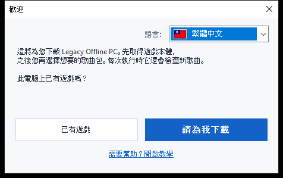
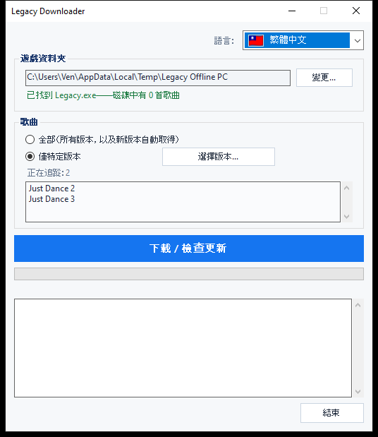
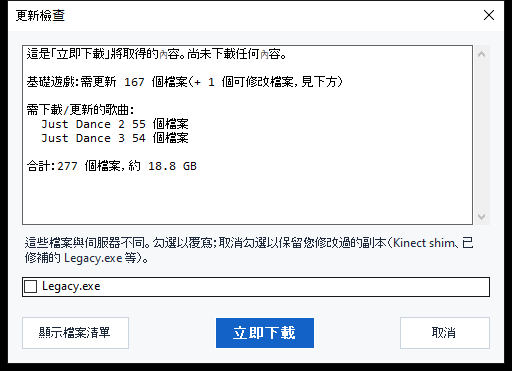

# Legacy Downloader — 教學

Legacy Downloader 會把 **Legacy Offline PC** 及其歌曲包下載到您的電腦上，並保持
更新。使用它不需要任何技術知識——只需按順序跟著下面的圖片操作即可。

其他語言：[English](en.md) · [Français](fr.md) · [Español](es.md) ·
[Deutsch](de.md) · [Italiano](it.md) · [Português](pt.md) · [Nederlands](nl.md) ·
[日本語](ja.md) · [한국어](ko.md) · [简体中文](zh-Hans.md) · [Русский](ru.md)

---

## 快速開始

如果您只想看簡短版本：

1. 從 [Releases 頁面](../../releases) 下載 zip 並解壓縮。
2. 雙擊 `LegacyDownloader.bat`。
3. 按照歡迎畫面的步驟操作，選擇您想要的歌曲，然後點擊
   **「下載 / 檢查更新」**。
4. 出現「一切就緒！」提示後，開啟遊戲資料夾中的 `Legacy.exe` 即可開始遊玩。

如果哪一步看起來令人困惑，或是與描述的畫面不一樣，下面的詳細步驟為每個
畫面都附有圖片。

---

## 1. 下載並解壓縮

1. 從 [Releases 頁面](../../releases) 取得最新的 `LegacyDownloaderVX.zip`。
2. 解壓縮它——在 zip 檔上按右鍵 → **全部解壓縮...** → 選擇一個普通資料夾
   （桌面即可）。請不要直接在 zip 視窗內執行它。
3. 開啟解壓縮後的資料夾，雙擊 **`LegacyDownloader.bat`**。


> 如果您的防毒軟體回報 `rclone.exe`（此資料夾中的一個檔案），請參閱下面的
> [疑難排解](#疑難排解) 部分——這是已知的誤判，並不是下載本身出了問題。

## 2. 首次執行——歡迎畫面

接下來會出現一個**「歡迎」**視窗。



- **顯示的語言不對？** 點擊右上角的國旗下拉選單，選擇您的語言——整個程式
  會立即切換。
- 接著回答它提出的唯一一個問題：
  - **「已有遊戲」** — 如果 Legacy Offline PC 已經在這台電腦上的某個位置，
    選擇這個。
  - **「請為我下載」** — 如果您還沒有這個遊戲，選擇這個。之後的一切都會
    自動完成。

### 如果您已經有這個遊戲
會彈出一個資料夾選擇視窗。找到並點擊直接包含 **`Legacy.exe`** 的資料夾
（不是子資料夾），然後點擊**選擇資料夾**。

### 如果您還沒有這個遊戲
會彈出一個資料夾選擇視窗，讓您選擇遊戲要放在哪裡——一個空資料夾，或者
您當場新建的資料夾（該視窗中有一個「新資料夾」按鈕）。點擊**選擇資料夾**
後，遊戲下載會立即開始——不需要再點擊其他按鈕。

這第一次下載的容量較大——大約 **1.2 GB**，依您的網路狀況，通常需要
5 到 20 分鐘。請**保持視窗開啟**直到完成；您會在視窗中看到進度在變化。

> 歌曲不包含在這第一次下載中——這次只下載遊戲本體，所以如果還沒看到
> 任何歌曲，不用擔心。

## 3. 主視窗

遊戲本體準備好後，您會看到這個畫面：



- **遊戲資料夾** — 您遊戲所在的位置。如果以後移動了遊戲，可以用
  **變更...** 指向新位置。
- **歌曲** — 選擇：
  - **全部** — 取得所有可用的 Just Dance 版本，以後新推出的也會自動取得。
    如果您不確定該選哪個，這是最簡單的選項——選它就對了。
  - **僅特定版本** — 點擊**「選擇版本...」**，只勾選您真正想要的遊戲
    （例如只要 *Just Dance 2019*），如果您不想下載全部內容的話。
- **「下載 / 檢查更新」** — 那個大按鈕。點擊它來取得您選擇的內容，之後隨時
  再次點擊即可檢查新歌曲或更新。

## 4. 檢查更新

點擊大按鈕並不會立即開始下載——它會先**檢查**缺少或有變化的內容。檢查
過程中，進度條可能只是來回滑動而不顯示百分比——這是正常現象，代表它仍在
將您的檔案與伺服器進行比對，而不是卡住了。



檢查完成後，會出現一個視窗列出找到的內容及總大小。點擊**「立即下載」**
來真正取得這些檔案，或者點擊**「取消」**，如果您只是想看看有哪些可用內容。
如果自上次以來沒有任何變化，它會直接顯示**「所有內容均已是最新狀態」**並
到此為止——沒有需要點擊的內容。

<details>
<summary>如果您修改過遊戲檔案（Kinect 模組、已修補的 exe 等）——點擊展開</summary>

如果您個人修改過的檔案（`Legacy.exe` 或某個 Kinect DLL）與伺服器版本不同，
它會單獨獲得一個核取方塊，而不是被自動包含在內：
- **已勾選** = 用伺服器的副本取代（如果您沒有修改過任何內容，請選這個——
  這只是一次正常的遊戲更新）。
- **未勾選** = 保留您自己的副本不變。

無論是否經過修改，您的遊戲內設定（解析度、視窗/全螢幕模式）都不會被更新
所觸碰。
</details>

## 5. 下載過程中

進度條和下方的日誌欄會即時更新——您會看到遊戲本體和每個歌曲包依序完成後
被列出來。**下載進行時請不要關閉視窗。** 全部完成後，您會看到：

> **一切就緒！開啟遊戲資料夾中的 Legacy.exe 即可開始遊玩。**

這就是成功的確認訊息——去啟動遊戲吧。

## 6. 之後回來取得新歌曲

隨時重新執行 `LegacyDownloader.bat` 即可。它會記住您的資料夾和歌曲選擇，
點擊**「下載 / 檢查更新」**就能取得自上次造訪以來的所有新內容。

- **新增或移除歌曲**：再次使用**「選擇版本...」**。取消勾選一個已下載的
  遊戲時，會詢問您是要同時刪除這些檔案，還是只是停止更新但保留現有內容。
- **變更語言**：右上角的國旗下拉選單，隨時可用。

---

## 文字/主控台版本（進階——大多數人不需要）

也有一個文字選單版本，供排除問題或您偏好使用：改為雙擊
**`LegacyDownloader-Console.bat`**。功能相同，用數字鍵導覽：

```
[1] 下載/檢查新歌曲
[2] 選擇要取得的歌曲
[3] 變更遊戲資料夾
[4] 語言
[5] 結束
```

> **字型說明：** 圖形版能正確顯示所有語言。這個文字版本需要一個包含正確
> 字元的字型——日文、韓文、中文和俄文在這裡可能會顯示為方塊（□）。如果
> 您需要這些語言，請使用圖形版本。

---

## 疑難排解

- **防毒軟體隔離或刪除了 `rclone.exe`** — 這是已知的誤判。有些防毒軟體
  會將 `rclone` 標記為「駭客工具」，因為攻擊者也可能使用它，但它實際上是
  一個合法且被廣泛使用的開放原始碼工具，也是本程式取得檔案所使用的唯一
  方式。請從防毒軟體的隔離區/歷史記錄中還原它並允許執行，然後重新執行
  `LegacyDownloader.bat`。
- **雙擊 `LegacyDownloader.bat` 時出現安全性警告** — 首次執行下載的指令碼
  時可能會發生這種情況。點擊繼續（「其他資訊 → 仍要執行」或類似的文字）——
  對於一個小型獨立工具來說這是正常現象，並不代表出了問題。
- **「找不到 rclone.exe」提示** — 重新下載 zip 並再次解壓縮；請不要在 zip
  檢視器內直接執行該工具。
- **點擊資料夾按鈕沒有反應** — 選擇視窗可能開啟在了主視窗*後面*；請查看
  您的工作列。
- **顯示「已是最新」但我缺少歌曲** — 開啟**「選擇版本...」**，檢查您是否
  真的選擇了想要的版本（或者選擇**「全部」**）。
- **仍然卡住了？** 請在 Discord 的 Legacy Downloader 討論串中發布您看到的
  內容截圖，並說明您卡在哪一步——會有人來幫助您。
